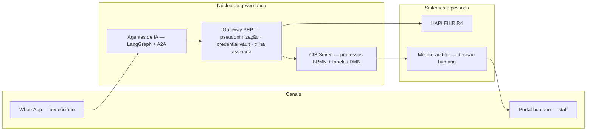

<p align="center">
  
</p>

<p align="center">
  <strong>Agentes de IA nomeados operam a operadora. BPMN/DMN (CIB Seven) garante a governança.</strong><br/>
  <em>Auditoria, SLAs regulatórios (ANS) e escalonamento humano garantidos por arquitetura — não por prompt.</em>
</p>

<p align="center">
  <a href="https://github.com/Omni-Saude/maezo-operadora/actions/workflows/ci.yml"></a>
  <a href="https://github.com/Omni-Saude/maezo-operadora/actions/workflows/security.yml"></a>
  
  
  
  
  
</p>

---

## O problema

Operar uma operadora de planos de saúde é operar prazos regulatórios e decisões sensíveis: autorização prévia dentro do SLA da ANS, glosas e recursos de contas médicas, reembolsos, inadimplência, credenciamento, submissões regulatórias — tudo sob LGPD e com trilha de auditoria que resiste a contestação. Hoje isso é executado por filas manuais, planilhas e sistemas que não conversam.

## A solução

O **Maezo** é uma plataforma **agents-first** de payer: dez agentes de IA **nomeados** — cada um com papel, escopo e dossiê próprios — executam as operações fim a fim, enquanto o **CIB Seven** (BPMN/DMN) atua como tabelião do processo: SLA regulatório, escalonamento humano obrigatório e trilha de auditoria não-repudiável são garantidos pela estrutura do processo, não pela boa vontade do modelo.

**A regra de ouro (ADR-0001):** o agente decide *como* trabalhar; o processo BPMN garante *que* as obrigações regulatórias serão cumpridas.

### Como funciona



Princípios inegociáveis:

1. **Nenhuma decisão clínica ou negativa de cobertura por agente.** Negativa = médico auditor, via User Task BPMN.
2. **LGPD por construção.** PHI pseudonimizado antes do contexto do LLM; dado integral só em infra aprovada, com egress de rede restrito e fail-closed.
3. **Multi-tenant absoluto.** Instância por cliente; zero contaminação entre operadoras.
4. **Toda decisão tem trilha.** Quem decidiu, com base em quê, aprovado por quem — assinada e ancorada.
5. **Regra determinística mora em DMN, não no LLM.**

---

## Os agentes

Dez agentes com identidade, escopo e matriz de autonomia próprios (`spec/agents/`):

| Agente | Papel |
|--------|-------|
| **Helena Moreira** | Health Navigator — triagem, roteamento e escalonamento humano via WhatsApp |
| **Rafael Nogueira** | Analista de Autorização Prévia — instrui a autorização e monta o dossiê do médico auditor |
| **Marina Andrade** | Analista de Contas Médicas e Recurso de Glosa — audita faturamento de prestadores e prepara recursos |
| **Lucas Ferreira** | Navegador de Atendimento e Cobrança do Beneficiário — cobrança, pagamentos e conciliação CNAB |
| **Beatriz Salgado** | Investigadora de Fraude — monta o dossiê; **nunca acusa**: a acusação nasce em tarefa humana |
| **Gustavo Andrade** | Operador de Calendário Regulatório ANS — submissões e obrigações junto à agência |
| **Carolina** | Analista de Credenciamento e Gestão de Rede — (des)credenciamento de prestadores |
| **André Nakamura** | Analista de População/Atuarial e Lago de Dados — enriquece dossiês com visão populacional |
| **Fernando** *(DRAFT)* | Inadimplência / cobrança avançada |
| **Valentina** *(DRAFT)* | Coordenação de Programas de Cuidado — estratificação de risco e plano de cuidado |

Cada agente é governado por uma **matriz de autonomia L0–L3 por ação** (ADR-0008): ações L0 — negativa de cobertura, acusação de fraude, cancelamento, decisão clínica — são **não-negociáveis** e sempre terminam em humano, com o runtime recusando (fail-closed) qualquer desvio.

---

## Jornadas cobertas

16 processos BPMN (`spec/processes/bpmn/`) com contrato de negócio versionado (~1.000 regras em `docs/processes/contracts/`) e decisão determinística em 63 tabelas DMN (`spec/processes/dmn/`):

| Jornada | Processos SP-OP |
|---------|-----------------|
| Autorização de atenção | `SP-OP-AUTH-001` |
| Contas médicas e glosas | `SP-OP-CONTAS-001` · `SP-OP-RECURSO-001` |
| Financeiro do beneficiário | `SP-OP-REEMBOLSO-001` · `SP-OP-PAGTO-001` · `SP-OP-INADIMPLENCIA-001` · `SP-OP-NIP-001` |
| Rede e relacionamento | `SP-OP-CRED-001` · `SP-OP-ADEQUACAO-001` · `SP-OP-CANCEL-001` · `SP-OP-PROGRAMA-001` |
| Regulação e conformidade | `SP-OP-ANS-SUBMIT-001` · `SP-OP-ANS-CRON-001` · `SP-OP-FRAUDE-001` · `SP-OP-LGPD-DSR-001` · `SP-OP-ESCALATION-001` |

O catálogo vivo com fase e status de cada processo está em [docs/processes/catalog.md](docs/processes/catalog.md).

### Portal humano

O staff da operadora não observa filas: **atua**. O [portal](src/maezo/portal/) (React + FastAPI) entrega as tarefas de escalonamento com contexto completo e registra a conclusão do humano **na mesma trilha de auditoria** do engine — completar pelo portal ou pelo processo BPMN produz evidências idênticas (ADR-0049).

---

## Segurança, LGPD e governança

- **PHI em duas zonas (ADR-0006).** A Zona Geral só vê PHI pseudonimizado (HMAC com chave por tenant); a Zona PHI/Financeira roda em infra aprovada, com egress de rede restrito por IP/CIDR e fail-closed — nenhum `0.0.0.0/0`.
- **Trilha de auditoria não-repudiável (ADR-0007).** Auditoria assinada com ancoragem e verificador de cadeia; cada decisão carrega quem, o quê, com base em quê.
- **Envelope A2A assinado (ADR-0039).** Delegação entre agentes carrega digest canônico com rotação de chave e verificação fail-closed.
- **Credencial fora do alcance do agente.** O credential vault garante que o runtime do agente **não possui** a credencial das ações que não pode executar.
- **Fronteira AMH (ADR-0037).** Integração com a plataforma de dados AMH por contratos canônicos AMH-owned, com pin de contrato e inicialização fail-closed — a Maezo não inventa campos de interface.
- **Supply chain.** SBOM + assinatura de imagem, dependências com quarentena de idade (`uv exclude-newer`), gitleaks e varredura de vulnerabilidades em CI.

---

## Onde estamos hoje

Honestidade é parte do produto. Esta plataforma está em **v0.2.0 alpha-dev**, com 15/15 milestones de construção **auto-certificados** (sem verificação independente). O fluxo de autorização ponta a ponta já foi **executado ao vivo em infraestrutura AWS de desenvolvimento** (ECS/Fargate, sa-east-1), incluindo a bloqueio de negativa mal justificada pelo médico auditor — registrado em [docs/status/validacao-aws-2026-08-18.md](docs/status/validacao-aws-2026-08-18.md).

O que separa esta base do go-live **não é código** — são ações que só humanos podem executar: segredos reais, `apply` de infraestrutura, contratos comerciais, ratificações de DPO, sign-off clínico/jurídico/regulatório e a revisão pré-lançamento. A lista viva por time está em **[docs/Tarefas_Pendentes.md](docs/Tarefas_Pendentes.md)**.

---

## Números (medidos em 2026-09-23 na `main`)

| Métrica | Valor |
|---------|-------|
| Agentes de IA nomeados | 10 (8 ativos + 2 em DRAFT) |
| Processos BPMN SP-OP | 16 |
| Tabelas de decisão DMN | 63 |
| Servidores MCP | 5 (CIB Seven, DMN, FHIR, WhatsApp, Memory) |
| Testes coletados (pytest) | ≈26.000 (`pytest tests -q --collect-only`) |
| Testes arquivados | 664 arquivos, ~306K LOC |
| Código fonte (`src/maezo/`) | 444 arquivos Python, ~165K LOC |
| ADRs | 59 (0001–0059; 43 ratificados, 16 em proposta/DRAFT) |
| Decision log | 49 decisões registradas |
| Runbooks | 32 (22 gerais + 8 de alerta + 2 drills) |
| Milestones de construção | 15/15 self-certified |

---

## Stack técnica

| Camada | Tecnologia |
|--------|-----------|
| Linguagem | Python 3.12, mypy `--strict`, ruff |
| Runtime de agentes | LangGraph + A2A SDK v1.0 + MCP |
| Engine de processos | CIB Seven 2.1.3 (BPMN + DMN) |
| API | FastAPI |
| Dados | PostgreSQL / Aurora, Alembic |
| Inferência LLM | Anthropic (zona geral) / Bedrock |
| Portal | React 19 + Vite + TypeScript, Playwright |
| Observabilidade | OpenTelemetry, Prometheus, Grafana (AMP/AMG) |
| Eventos (dev local) | Kafka |
| Entrega | Docker, AWS ECS/Fargate (dev), Helm |

## Início rápido (desenvolvimento)

```bash
# Pré-requisitos: Python 3.12, Docker, make, uv
make setup             # uv sync --extra dev
make dev-stack         # postgres, cibseven, hapi-fhir, kafka
cp .env.example .env   # preencher chaves
make test              # testes unitários
make validate-artifacts  # valida BPMN/DMN/agent.yaml/policies (bloqueia CI)
```

Para contribuir, leia [CONTRIBUTING.md](CONTRIBUTING.md) — inclui as receitas de "adicionar agente", "adicionar ferramenta MCP" e "adicionar processo SP-OP".

## Estrutura do projeto

```
src/maezo/
├── agents/          # 10 agentes (Helena, Rafael, Marina, ...)
├── a2a/             # Agent2Agent: registry, anti-loop, card
├── gateway/         # PEP, pseudonymizer, audit chain, credential vault, custody
├── portal/          # Portal humano: api (FastAPI), web (React), engine, admin
├── platform/        # Validation CLI, topic registry, erasure, retention, observability
├── runtime/         # LangGraph harness, checkpointer, inference
├── adapters/        # Fronteira AMH (contratos canônicos)
├── ports/           # Envelope canônico A2A (28 campos, pinado)
├── domain/          # Regras de domínio puras
└── tools/
    ├── workers/     # 16 workers BPMN (auth, contas, fraude, nip, ...)
    ├── mcp_cibseven/
    ├── mcp_dmn/
    ├── mcp_fhir/
    ├── mcp_whatsapp/
    └── mcp_memory/
```

## Documentação

| Documento | Conteúdo |
|-----------|----------|
| [docs/Tarefas_Pendentes.md](docs/Tarefas_Pendentes.md) | **Tarefas humanas pendentes por time (deploy, segredos, ratificações, sign-offs) — pré go-live** |
| [docs/architecture/overview.md](docs/architecture/overview.md) | Visão arquitetural completa |
| [docs/adr/](docs/adr/) | 59 ADRs numerados (0001–0059; recontado 2026-09-23) |
| [docs/processes/catalog.md](docs/processes/catalog.md) | Catálogo dos processos SP-OP |
| [docs/processes/contracts/](docs/processes/contracts/) | 16 contratos SP-OP — ~1.000 regras de negócio |
| [docs/decisions-log.md](docs/decisions-log.md) | 49 decisões operacionais |
| [docs/runbooks/](docs/runbooks/) | 32 runbooks operacionais (22 gerais + 8 de alerta + 2 drills) |
| [docs/observability/SLO.md](docs/observability/SLO.md) | SLIs/SLOs (DRAFT) para worker-runtime, agent-runtime e gateway |
| [CONTRIBUTING.md](CONTRIBUTING.md) | Como contribuir: princípios, receitas de agente/MCP/processo |
| [SECURITY.md](SECURITY.md) | Política de segurança e divulgação responsável |
| [RELEASE.md](RELEASE.md) | Processo de release |
| [AGENTS.md](AGENTS.md) | Guia para desenvolvimento assistido por IA |
| [PLANS.md](PLANS.md) | Plano de implementação greenfield |
| [PROJECT.md](PROJECT.md) | Arquitetura em 30s |

## CI/CD

| Pipeline | Job |
|----------|-----|
| **CI** (`ci.yml`) | lint (ruff), tipos (mypy `--strict`), testes unitários, terraform validate, helm lint |
| **CD** (`cd.yml`) | Build & push ECR, deploy staging, smoke tests, promoção de produção com aprovação registrada |
| **Security** (`security.yml`) | Gitleaks (segredos); CodeQL roda com upload de SARIF condicionado a GHAS; dependency review com skip automático sem GHAS |
| **Supply chain** (`supply-chain.yml`) | SBOM + assinatura de imagem |
| **Evidence Ledger Gate** (`evidence-ledger.yml`) | Valida as entradas de evidência do repositório |
| **Flip-path review gate** (`flip-path-review-gate.yml`) | Exige revisão humana em mudanças sensíveis de proteção |
| **Branch protection check** (`branch-protection-check.yml`) | Audita semanalmente a configuração de proteção da `main` |
| **Red main alarm** (`red-main-alarm.yml`) | Alerta a cada 2h quando a `main` está vermelha |

<p align="center">
  
</p>

## Licença

**Proprietary.** Uso interno Americas Health (AMH); sem licença de redistribuição.
