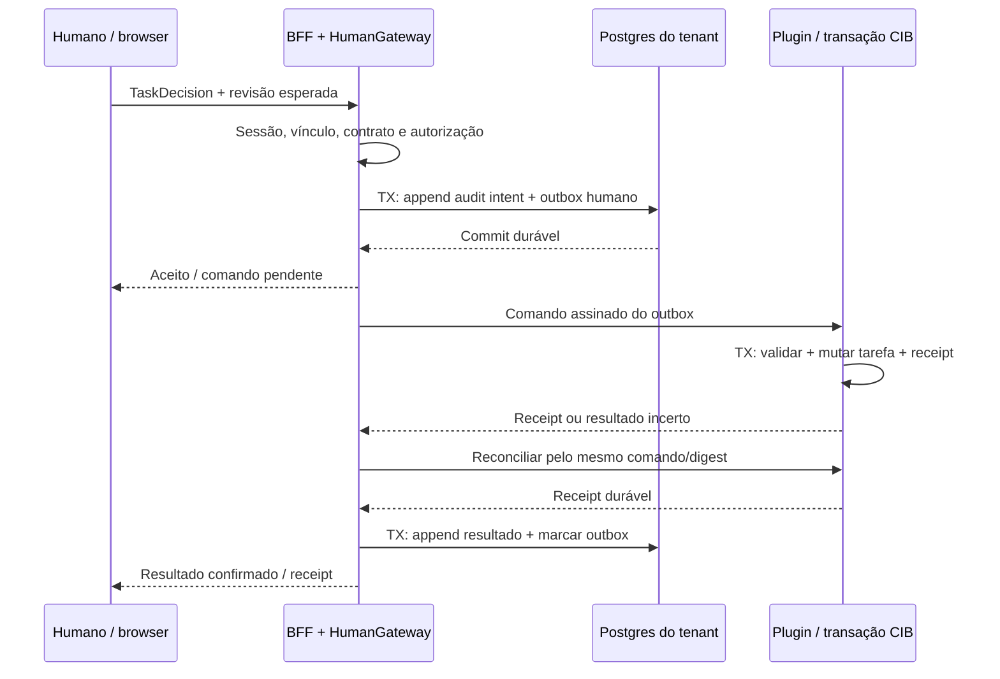

# ADR-0049: Portal humano Maezo e comandos atomicos no engine

**Status:** Accepted quanto à decisão de produto/engenharia autorizada no plano do usuário;
especificação técnica **DRAFT/verify**, revisão independente e implementação **PENDENTES**.
**Data:** 2026-09-08
**Area:** Produto / Segurança / Transações / Auditoria / Tenancy
**Proveniência:** plano consolidado `docs/plan.md`, §3 Wave 1 e §4–5, e mandato de execução
`docs/prompts/execute-maezo-completion-plan.md`. Registro documental do agente sob esse mandato;
não é ratificação autônoma, assinatura individual ou aprovação de software ainda não construído.
**Rastreio:** `PLAN-PRODUCT-PORTAL-SUPERSEDE-TASKLIST` (identificador novo de coordenação, sem ID
histórico original localizado); dependências `PORTAL-HUMAN-GATEWAY`, `PORTAL-ATOMIC-COMMAND`,
`PORTAL-AUDIT-OUTBOX`; DL-0048.

Nenhuma aprovação clínica, DPO, jurídica, atuarial, financeira, regulatória ou de produção é
concedida por este documento. A autorização de engenharia permite construir e verificar os
mecanismos; os valores e atos humanos continuam nos respectivos contratos/políticas. Este ADR
não certifica WCAG, prontidão, entrega, deploy, identidade ratificada ou uma decisão de paciente.

## Contexto

O plano autorizado substitui a escolha anterior de produto baseada somente em Tasklist por um
portal próprio, mantendo CIB Seven como autoridade do processo. A fonte preservada
`/Users/familia/Downloads/plan.md`, §Wave 1, registra explicitamente essa substituição; seu
SHA-256 é `d0218f1dff955bd09fe84300121c92412d91c0b739fdc847c71c50f9794e71c7`.
O plano consolidado lido nesta redação tem SHA-256
`53215026ed494a928f062627db87aa71ade1cc27bf257be257c957510ec4a6bf`.
Esses arquivos eram locais no início do pacote; as decisões necessárias estão reproduzidas aqui
para a coordenação versionada não depender apenas de um link para Downloads ou de um transcript.

`docs/runbooks/devops-stack.md`, seção HITL, ainda descreve humanos completando User Tasks pela
Tasklist diretamente. Essa é evidência do fluxo existente, preservada sem reescrita retroativa.
O portal, o gateway humano e o plugin transacional abaixo **não existem como entrega deste ADR**.
A rota de demonstração em `src/maezo/platform/testchannel/paginas/autorizacao.html` completa
tarefas pelo proxy `/engine`; esse canal de desenvolvimento não é um backend de produção.

Inventário da árvore base `e9689e7dacc0417d5c7fe10d6c520f8df66d33cf`, extraído do XML BPMN:
**43 User Tasks em 15 famílias**, incluindo assunções por coordenação; **38 sem formData**;
**27 identificadores estáticos** de candidate-group e **4 expressões dinâmicas**. Isso é um
inventário de obrigações de formulário, não uma contagem de telas implementadas. A cada nova
versão de processo, o catálogo deve ser reconciliado contra a árvore e o deployment efetivo.

Regras de negócio continuam em SP-OP, DMN e políticas: AUTH mantém negativa/decisão clínica
humana; PAGTO mantém lastro, segregação e alçada; LGPD mantém identidade e revisão DPO/humana.
Não se transporta uma regra de seguro, banco ou aviação para Python, TypeScript ou prompt.
Os antecedentes `lgpd-negar-fundamentado-classified-neutral`,
`no-denial-boundary-escape-reachability-blindspot` e `audit-chain-from-rows-ts-reorder-verify-flap`
do predeploy impõem cuidado com histórico humano, timers e encadeamento de auditoria.

### Alternativas consideradas

| Alternativa | Consequência | Disposição |
|---|---|---|
| Tasklist como único produto humano | Preserva operação existente, mas não entrega as experiências, escopo de dados e recuperação exigidos pelo novo plano | Substituída como escolha de produto; histórico preservado |
| Reutilizar testchannel/proxy REST como portal | Expõe superfície genérica do engine, sem fronteira humana ou comando atômico demonstrado | Rejeitada |
| Portal próprio, BFF separado e comando humano transacional no CIB | Exige novo catálogo, identidade, plugin e recuperação, mas permite provar as garantias exigidas | Escolhida no plano autorizado |

## Decisao

### D1 — Produto, públicos e experiência (plano §4, pesquisa/produto)

Construímos um portal Maezo em **pt-BR**, com experiências separadas para colaboradores,
beneficiários e prestadores. São mantidos os três padrões de pesquisa do plano:

| Referência | Adaptação Maezo, sem importar regra de negócio |
|---|---|
| [Guidewire — atribuição de atividades](https://docs.guidewire.com/cloud/cc/202511/cloudapibf/cloudAPI/topics/141-Framework/01_activities/c_assigning-activities.html) | Filas de grupo, responsabilidade explícita, claim e reatribuição |
| [Backbase — banking operations](https://www.backbase.com/solutions/banking-operations) | Workspace compartilhado de caso, evidências, preparação e decisão humana |
| [Airbus — planning and operations control](https://www.skywise.com/en/digital-solutions/planning-operations-control) | Visibilidade operacional e tratamento coordenado de exceções |

As referências informam interação; contratos Maezo decidem permissões e desfechos.

| Público | Capacidade a entregar dentro da autoridade real |
|---|---|
| Atendimento e supervisão | Intake, filas próprias/de grupo, escalonamento e acompanhamento de handoff |
| Auditoria médica, coordenação clínica e junta | AUTH, análises clínicas e decisões de programas |
| Contas, recursos, reembolso e finanças | CONTAS, RECURSO, REEMBOLSO e PAGTO sem ampliar alçadas |
| Gestão de rede e jurídico | Credenciamento, descredenciamento e adequação de rede |
| Regulatório e jurídico | NIP, ANS, correções/NACK, cancelamento e inadimplência |
| Investigação de fraude | Evidência restrita, cadeia de custódia e conclusões humanas autorizadas |
| DPO/privacidade | DSR com identidade verificada e disposições permitidas |
| Administração do tenant e observadores | Membership e saúde operacional; sem acesso clínico/PHI implícito |
| Beneficiários | Seus pedidos, estados, documentos pendentes, comunicações e recibos |
| Prestadores | Suas guias, solicitações de rede, contas/glosas, recursos e recibos |

Navegação de colaboradores: **Visão geral · Meu trabalho · Filas da equipe · Casos · Documentos ·
Operações · Administração**. O caso reúne resumo, prazo, responsável atual, dossiê, proveniência
das evidências, formulário permitido e histórico cronológico. Toda decisão pede revisão explícita
e retorna recibo verificável. Não haverá aprovação clínica, adversa ou financeira em lote.
ANS cron, iniciado por timer, aparece em monitoramento; não ganha atalho de start manual.

### D2 — Catálogo humano vinculado ao processo (plano §4, produto/interfaces)

Os 43 formulários abrangem todas as tarefas, inclusive takeovers de coordenação. O catálogo
versionado usa a chave imutável `(process_definition_key, process_definition_version,
task_definition_key)` e fixa também `process_definition_id`, digest do BPMN e versão/digest do
formulário. Uma tarefa de versão antiga continua usando seu contrato antigo; não se aplica o
formulário da última versão a instâncias em andamento. Chave/versão ausente recusa decisão,
exibe indisponibilidade e cria pendência operacional; não gera formulário genérico de variáveis.

Cada entrada aponta para contrato SP-OP, tarefa BPMN, inputs/desfechos permitidos, validações
condicionais existentes, evidência somente leitura, binding de proveniência, candidate-groups,
timers e testes positivos/negativos. Não cria opções, tiers, limites ou prazos por inferência.
Os identificadores estáticos existentes são preservados literalmente:

`analise-reembolso`, `analista-recurso-glosa`, `auditoria-contas`,
`coordenacao-auditoria-medica`, `coordenacao-clinica`, `coordenacao-cobranca`,
`coordenacao-contas`, `coordenacao-contratos`, `coordenacao-financeira`,
`coordenacao-investigacao`, `coordenacao-recurso`, `coordenacao-rede`,
`coordenacao-reembolso`, `coordenacao-regulatorio`, `equipe-cuidado`, `gestao-cobranca`,
`gestao-contratos`, `gestao-rede`, `investigacao-fraude`, `junta-medica`,
`juridico-contratos`, `juridico-fraude`, `juridico-rede`, `juridico-regulatorio`,
`medico-auditor`, `regulatorio-ans`, `supervisao-atendimento`.

As expressões `${grupo_humano}`, `${pagto_alcada.grupo_aprovador}`,
`${roteamento.grupo_atendimento}` e `${roteamento_dsr.grupo_revisor}` são resolvidas no servidor
a partir do estado autoritativo do engine e intersectadas com membership autenticado. Não se
executa expressão fornecida pelo browser. **Os valores dinâmicos não são limitados artificialmente
aos 27 estáticos**: grupos DPO/financeiros, entre outros, vêm de seus contratos/roteamento e da
membership autorizada. Ausência, forma inválida ou origem não confiável não concede grupo.

Exemplos vinculantes para os primeiros slices:

- **AUTH:** `UT_AnaliseMedicoAuditor`, `UT_CoordenacaoAssume`, `UT_RegistrarParecerJunta` e
  `UT_DecidirPendenciaExpirada` conservam a autoria humana prevista no contrato. Preparação
  Rafael não se torna decisão de cobertura; timeout não aprova nem nega automaticamente.
- **PAGTO admissibilidade:** `lastro_origem`, `lastro_decisor_id` e evidência de duplicidade são
  somente leitura. A escolha `PROSSEGUIR`/`DEVOLVER` em `UT_AnaliseAdmissibilidade` não libera
  pagamento: precede a escada de alçada. Evidência de obrigação nunca é promovida a confirmação
  automática de obrigação (`I-PAGTO-1`). Tier e identidade do aprovador vêm do servidor/contrato,
  não de inputs do navegador. Tetos, faixas e política colegiada DRAFT continuam humanos.
- **LGPD:** `UT_RevisaoDpo` conserva `APROVAR_ENVIO`, `EXECUTAR_E_ENVIAR` e
  `NEGAR_FUNDAMENTADO`, com identidade/revisão/fundamentação segundo o contrato. Este portal não
  inventa o produtor ratificado de identidade, não torna `human_approved` uma aprovação por
  simples presença e não ativa os seams de execução hoje inertes.

**Lacuna PAGTO observada nesta base:** plano e BPMN declaram `decisao_admissibilidade` e
`PROSSEGUIR`/`DEVOLVER`, enquanto a tabela do contrato SP-OP-PAGTO-001 não enumera literalmente
esse campo/desfechos; ela declara os fatos de lastro e a User Task. O pacote de catálogo deve
reconciliar essa documentação contra o BPMN antes de implementar o formulário. Não é licença
para inventar decisão ou converter lastro em fato, nem é emenda silenciosa do contrato neste ADR.

### D3 — Fronteira web e contratos imutáveis (plano §4, frontend/interfaces)

Frontend React/TypeScript/Vite em **`src/maezo/portal/web`**, BFF FastAPI em
**`src/maezo/portal/api`**, implantado separadamente dos runtimes de agente. Esses são paths de
implementação futura, não módulos entregues por este documento. Componentes compartilhados
usam HTML semântico, tabelas/formulários acessíveis, foco visível, status textuais e responsividade.
As filas visíveis atualizam **a cada dez segundos**, mostram freshness e falha de dependência;
essa atualização de tela nunca substitui validação autoritativa da decisão no engine.

Sem PHI em URLs, analytics de browser, armazenamento persistente do navegador ou caches offline.
Navegação usa referências opacas; anexo/documento exige autorização por recurso em toda leitura.
Não enviar tokens, dossiê ou estado de aprovação a localStorage/IndexedDB/service-worker cache.
Erros renderizados, telemetria, filenames/metadata de anexos e breadcrumbs são superfícies PHI;
manter minimização e controle de acesso sem remover observabilidade de operação/falha.

Contratos sem mutação in-place, com versão explícita e validação que rejeita campos desconhecidos:

| Contrato | Conteúdo e fonte de autoridade |
|---|---|
| `HumanPrincipal` | `principal_ref`, issuer/subject imutáveis, tenant, membership/revisão, sessão/autenticação e vínculos de sujeito; construído pelo servidor, nunca desserializado do browser como autoridade |
| `TaskSnapshot` | ID da tarefa, definição/versão/digest do processo e formulário, revisão da tarefa, responsável, grupos resolvidos elegíveis, revisão/digest de evidência, prazos do engine, ações/inputs permitidos; snapshot imutável e explicitamente datado |
| `TaskDecision` | `command_id`, referência da tarefa/formulário e revisões esperadas, desfecho e inputs tipados pelo contrato específico; sem actor/tenant/tier editável, `human_approved` arbitrário ou mapa aberto de variáveis do engine |
| `HumanCommandReceipt` | Identidade do comando, tenant/tarefa opacos, digest do payload, disposition técnica, referências do principal e workload, revisão consumida/resultante quando aplicável, commit/receipt do engine e vínculo de auditoria; conteúdo verificável, não uma inferência do HTTP 202 |

O browser recebe apenas a projeção necessária desses contratos. API OpenAPI versionada é a fonte
do cliente TypeScript **gerado**; não manter tipos manuais concorrentes. Mudança incompatível
exige nova versão e teste de compatibilidade. O catálogo é o discriminador dos inputs da decisão,
não uma função genérica que aceita quaisquer process vars.

Acesso humano autorizado a um dossiê não dissolve as zonas: componentes que servem PHI bruto e
anexos permanecem na Zona PHI; engine na Zona Geral recebe somente a projeção classificada e
permitida pelo contrato, referências/digests de evidência e proveniência minimizada. Não copiar
anexos ou narrativa clínica bruta ao engine, audit log ou evento geral. Se um formulário exigir
campo incompatível com essa classificação, reconciliar seu contrato/binding antes de ativar,
sem retirar silenciosamente fundamentação humana obrigatória ou conceder exceção PHI pelo portal.

Superfícies públicas planejadas em `/api/v1/portal`:

| Interface | Operação/limite |
|---|---|
| `GET /session` | Identidade/projeção de entitlements da sessão autenticada |
| `GET /tasks`, `GET /tasks/{task_id}` | Filas elegíveis e TaskSnapshot; filtros nunca ampliam o escopo calculado no servidor |
| `POST /tasks/{task_id}/claim`, `/release`, `/decisions` | Comandos humanos tipados, com revisão esperada, CSRF e autorização; sem proxy REST genérico |
| `GET /commands/{command_id}`, `/commands/{command_id}/receipt` | Estado técnico e recibo autorizado; não confundir aceitação com execução |
| `GET /cases`, `/cases/{case_ref}`, `/cases/{case_ref}/history` | Casos/histórico limitados a tenant, papel e vínculo de sujeito |
| `/cases/{case_ref}/document-requests`, `/cases/{case_ref}/attachments` | Pedir/enviar/consultar documentos conforme contrato e ACL do recurso; nenhuma URL PHI ou acesso por saber um ID |
| `GET /operations/summary` | Resumo operacional conforme papel, sem PHI implícito para administrador/observador |

Esses paths são contratos de construção: métodos de escrita em documentos/intake serão os
estritamente previstos no catálogo, não CRUD irrestrito. Beneficiário/prestador não recebe
capacidade de completar User Task interna por compartilhar o mesmo BFF.

**Dinheiro:** centavos atravessam browser/API como strings decimais de inteiro, validadas sem
fracionário, expoente, conversão via float/JavaScript Number ou coerção de bool. Sinal/faixa
dependem do contrato; este ADR não cria limites monetários. Backend converte para inteiro exato
e o transport preserva a tipagem do engine, inclusive ao receber envelopes já formatados. Timers
regulatórios continuam BPMN-owned; o navegador apenas apresenta o prazo autoritativo.

### D4 — Autenticação, vínculo e gateway humano (plano §4, autenticação/autorização)

Criamos client **humano dedicado** no Cognito com OIDC Authorization Code + PKCE. O client
machine-to-machine existente não comprova identidade humana. Callback valida issuer, audience,
state/nonce, PKCE e demais controles OIDC; redirects são explicitamente registrados. Tokens
permanecem no servidor; o browser recebe cookie de sessão opaco **Secure/HttpOnly/SameSite=Lax**,
com CSRF e validação de Origin nas mutações. Não usar e-mail/nome como identidade estável.
Referência de configuração: [AWS Cognito app clients](https://docs.aws.amazon.com/cognito/latest/developerguide/user-pool-settings-client-apps.html).

Tenant resulta do deployment e da membership autorizada. Mudança de contexto de tenant exige
nova resolução no servidor; header/body do browser não define essa autoridade. Identidade humana
é `(issuer, subject)`, mapeada a referência interna estável. Beneficiário/prestador só vê um
registro após prova de vínculo com o sujeito/organização correspondente; login, grupo genérico
ou posse do identificador não bastam. Administração de membership é separada de decisão clínica.
Revogação/alteração de membership invalida a autoridade de novas decisões e seu snapshot; na
execução, principal e revisão de autorização devem continuar válidos. Incerteza recusa efeito.

O **HumanGateway**, em futuro `src/maezo/gateway/human`, é separado e **sempre enforcing**.
Não depende de `ActionExecutionGateway` em shadow, de policy flip ou de allowlist de testes.
A factory produz transporte humano tipado, ligado a tenant/workload e partição de credenciais
própria do cofre. BFF não constrói cliente genérico do engine com segredo de agente ou administrador.
Gate verifica papel/membership, atribuição/claim, versão do processo/formulário, evidência/revisão,
permitidos e consent/vínculo exigidos pelo contrato. Indisponibilidade de auth/audit/evidência
exigida falha fechada, sem inventar resultado clínico ou financeiro.

Principal humano e serviço executor são identidades distintas na trilha: a assinatura atesta
que o workload autorizado validou o comando daquele humano; **não é assinatura pessoal do humano**.
Um robô que conhece o actor_id não se torna humano. Credenciais de agente nunca ganham mutação
humana para viabilizar o portal. Hard L0, PEP, User Tasks e guards de efeitos continuam cumulativos.

### D5 — Comando assinado e transação do engine (plano §4, decisões atômicas)

Construímos extensão Java na imagem pinada **CIB Seven 2.1.0**, pelo mecanismo de
[process engine plugins](https://docs.cibseven.org/manual/2.1/user-guide/process-engine/process-engine-plugins/).
O mecanismo permite extensão; **a atomicidade abaixo é requisito de implementação Maezo**,
não capacidade automaticamente provada pelo link. Código futuro em `src/maezo/portal/engine`,
empacotado pela imagem existente em `deploy/cibseven/`; não alterar a versão do engine por conveniência.

Interface interna planejada: `POST /maezo-human/v1/commands` e
`GET /maezo-human/v1/receipts/{task_id}/{command_id}`, em rede restrita, autenticando workload e
tenant. Não são endpoints públicos do browser. O transporte usa `HumanCommandEnvelope` versionado,
com semântica imutável: command/task/tenant, principal humano, workload emissor, operação
(claim/release/decision), processo/formulário pinados, inputs/desfecho permitidos e revisões de
tarefa/evidência/autoridade. Evidências são referências a snapshots imutáveis com digest e origem;
não são strings arbitrárias interpretadas como fatos.

O digest semântico é SHA-256 dos bytes canônicos UTF-8 do comando, com perfil JSON explícito
**JCS/RFC 8785**, sem nomes duplicados, valores não finitos ou coerção `default=str`; inteiros de
precisão arbitrária, especialmente centavos, usam strings. Não modificar Unicode depois de
assinar. Vetores Python/Java devem provar equivalência. É um perfil novo para comandos humanos,
não uma mudança na canonicalização A2A já aceita.
[RFC 8785 — canonicalização JSON](https://www.rfc-editor.org/rfc/rfc8785).

O envelope de transporte assina também purpose/audience, digest, issuer de workload, tenant,
key-id/esquema e validade. Chaves têm propósito **human-command**, isoladas por tenant/ambiente
em cofre/KMS; não reutilizar PHI_HMAC_KEY, segredo OIDC ou chave A2A. O perfil de assinatura
versionado fixa algoritmo verificável, keyset confiável e regras de rotação/revogação no pacote
de implementação de segurança; algoritmo indicado pelo remetente fora desse perfil é recusado.
Nenhuma opção de assinatura ausente/unverified é permitida em produção. Não herdar os sete dias
ou qualquer retenção do ADR-0039: ele rege outro envelope. Valores operacionais precisam ser
explícitos e verificados antes de ativar; não são assinaturas/valores humanos fabricados aqui.

**Uma única transação no datasource/CommandContext do engine, sem chamadas remotas no meio:**

1. Validar workload, tenant, assinatura/propósito/validade, principal autorizado e schema.
2. Verificar receipt sob chave única `(tenant, task_id, command_id)` e digest. Retry idêntico
   retorna receipt existente; reutilização com payload/principal divergente devolve conflito,
   sem reexecutar. A consulta de receipt também exige autorização, não só posse do command_id.
3. Travar/validar tarefa ativa, atribuição, revisão, definição/formulário, autoridade e revisão
   de evidência. Divergência gera conflito; não completar uma tarefa sucessora de timer/reassignment.
4. Escrever **somente** variáveis permitidas pelo binding do formulário, acrescentando proveniência
   humana/workload derivada do servidor, e completar a tarefa pela API interna do engine.
5. Persistir receipt e commit junto com as alterações; falha de qualquer etapa reverte todas.

Claim/release usam comandos igualmente autenticados e transacionais, sem completar tarefa nem
escrever desfecho. O estado de receipt distingue a operação efetivamente aplicada. Recusa
técnica não vira negativa humana; conflitos de revisão não entram como decisão no BPMN.
Resposta incerta de transporte não prova rollback nem commit.

**Autoridade das revisões e corridas:** engine mantém a revisão da evidência aceita para a tarefa
e referências/digests imutáveis. Toda atualização aceita de evidência, assignment ou autorização
que invalida decisão participa do mesmo domínio de serialização e invalida o snapshot anterior.
Não comparar apenas um número fornecido pelo BFF contra ele mesmo. Fonte externa mutável não
pode ser consultada de modo não atômico e depois chamada de “evidência atual”: pin da versão
e política de freshness vêm do contrato; atualização de sua projeção no engine precisa do
mesmo guard. Não se alega atomicidade instantânea com IdP, FHIR ou outros bancos externos.
Ausência/atraso não resolvido da revisão autoritativa exigida impede executar.

Optimistic locking/locks e unicidade do receipt devem ser provados contra: dois cliques, dois
revisores, novo command_id para a mesma tarefa, timers interruptivos, reassignment, mudança de
evidência e outro cliente de tarefa. Após perder a corrida, o comando devolve conflito, nunca
reescreve a decisão vencedora nem reabre/termina silenciosamente a instância.

### D6 — Audit intent, outbox humano e recuperação (plano §4, auditoria/recuperação)

Há duas transações locais, não uma transação distribuída implícita:

O audit intent e um **outbox de comandos humanos dedicado** são persistidos na MESMA transação
por tenant **antes** de qualquer dispatch. Não reutilizar a tabela de dedup WhatsApp ou o outbox
de fatos A2A como registro de autorização humana. Payload imutável/digest, principal, revisões,
intent e estado técnico têm ligação verificável; acesso/armazenamento de campos PHI obedecem
ADR-0006 e políticas aplicáveis, sem payload livre em logs/URLs/labels.

A extensão do audit sink para enlistment recebe conexão/transação tenant-bound confiável da
composition root e preserva o mesmo algoritmo de hash/canonicalização, advisory lock por tenant,
tail estrutural, unicidade, append-only e rollback do `PostgresAuditSink`. Não abre segunda
conexão em `emit()` durante a transação esperando atomicidade, não usa head cache nem ordena
cadeia por timestamp. Consumidores existentes conservam sua semântica. Falha antes do commit
de intent/outbox impede dispatch; não há “audit best effort”. Isto estende o uso transacional
do ADR-0027, não reintroduz dual-write síncrono Kafka.

O relay assume trabalho pendente com exclusão/lease técnica, sem manter lock Postgres durante
HTTP; reconcilia resultado incerto pelo receipt e só marca execução após prova. Canonical payload
permanece igual entre tentativas; renovar envelope de transporte autorizado não altera a decisão
ou torna uma revisão vencida atual. Compensação não apaga audit ou decisão clínica/financeira.

| Falha | Estado/recuperação exigidos |
|---|---|
| Antes de commit de intent/outbox | Nenhum dispatch/efeito; erro seguro, nenhuma conclusão fabricada |
| Após commit e antes de enviar | Outbox durável pendente; recuperação após restart |
| Engine falha antes do commit | Variáveis/tarefa/receipt revertidos juntos; retry da mesma identidade |
| Engine commitou, resposta perdida | Estado incerto; consultar receipt ou repetir idêntico sem duplicar efeito |
| Receipt recebido, append do resultado falha | Intent e receipt já existem; manter reconciliação pendente e reparar resultado auditável, sem afirmar rollback do efeito já commitado |
| Revisão/assignment mudou ou chave reutilizada com outro digest | Conflito explícito, sem autoaprovação, sem editar vencedor |

O BFF pode responder **202 aceito/pendente** após persistência, mas nunca “executado” por ter
recebido a requisição, adquirido claim ou gravado outbox. `HumanCommandReceipt` só confirma
execução a partir do receipt durável do engine, vinculado ao resultado persistido. Eventos
externos continuam seguindo seus contratos/outboxes; não há promessa exactly-once entre sistemas.
Retenção/expurgo de intent, payload, receipt e chaves é parte da matriz DPO/segurança aplicável,
não um TTL inventado neste ADR.

### D7 — Impedir bypass e migrar todos os callers (plano §4, REST/ingressos)

Proteger REST do engine é requisito de produção, não só esconder botões. Após cutover verificado,
credenciais de agente não podem claim/release/complete/delegate/resolve User Tasks, trocar assignee,
mudar seus identity links ou gravar decisões/proveniência humanas por outro endpoint. Permissões
e transporte também precisam impedir bypass por variáveis de task/execution/process-instance,
correlation com campos humanos, startInstructions/modification/restart, deployment de definições
ou APIs administrativas. Deployment usa identidade operacional separada e artefatos pinados,
sem conceder ao agente capacidade de substituir guards/BPMN. Não bloquear indiscriminadamente
os starts/correlations externos legítimos: migrar cada caller para operação tipada, escopo e
campos autorizados, sem acesso à autoridade humana. Workers external-task autorizados conservam
fetch/lock/complete/failure/BPMN-error do seu contrato; a permissão para external tasks não inclui
complete de User Task ou escrita alternativa de decisão/proveniência humana.

Inventário de propagação inclui factory/seams CIB, transport de starts/correlation, worker
external-task transport, bootstrap/deploy do engine, bridges/daemons, scripts/evidência e clientes
humanos Tasklist/testchannel. Revalidar o inventário no SHA integrado; uma credencial legada
administrativa esquece o bloqueio de todo o portal. Outros clientes que mutem tarefas governadas
devem usar a mesma fronteira e receipt, ou ser recusados. Break-glass não é bypass silencioso:
se existir, exige desenho/aprovação próprios, identidade e auditoria, sem concessão automática aqui.

O histórico de Tasklist não é apagado; a migração operacional ocorre somente quando portal,
plugin, callers e controles de acesso estiverem verificados. Até lá, estado atual continua
declarado como tal. `testchannel` não é exposto nem promovido a backend do portal.

Intake reutiliza entrypoints de processo tipados e dedup de starts existentes, sem aceitar
process_definition arbitrária/variáveis privilegiadas. Preserva a ponte TISS deliberadamente
**dormente**: não a ativa como efeito colateral das telas de prestador. FHIR/AMH são consumidos
pelos ports canônicos read-only e vínculos de fonte; o portal não cria acesso cru Tasy/HAPI/Gold.

### D8 — Deployment, confiança entre repos e rollback (plano §5)

Alvo autorizado: **ECS/Fargate em `sa-east-1`**. Reconciliar CD antigo Helm/EKS sem provisionar
dois alvos concorrentes. Separar tenant/ambiente, workload identities, redes, secrets e acesso
a banco; engine REST restrito, TLS, auth humano e rotação de secrets verificáveis. Manter imagens
reprodutíveis de aplicação/frontend/plugin-engine com dependências pinadas, SBOMs e assinaturas.
Kafka de produção deve ser durável; o broker efêmero de desenvolvimento não satisfaz o requisito.

Mudanças cross-repo vão pelo dono do estado Terraform correspondente. Em especial, não assumir
ownership da security group Aurora de outro repo, importar recursos para dois states ou aplicar
SQL/infra hospitalar como atalho. Migrações revisadas, compatibilidade, backup/restore, entrega de
alertas, dashboards e rollback fazem parte da entrega, não anexos opcionais.

Ordem: **pré-requisitos de infraestrutura → migrações de banco → engine/auth bootstrap → workers
e gateways → runtime de agentes → portal → jornadas sintéticas de smoke**. Validar staging antes
de produção; promover os mesmos digests testados. Rollback troca imagem compatível e preserva
receipt/audit/outbox; não apaga evidência nem reverte dados/migrações cegamente.

### D9 — Propagação, ownership e ordem de construção (plano §2, §4 e §5)

Todos os destinos “a criar” abaixo estão PENDENTES. São limites de pacote e contratos de
implementação posterior; não inventário de código já existente.

| Ordem/pacote | Ownership especializado e superfície | Interface/dependência e entrega verificável |
|---|---|---|
| 1 — Arquitetura/catálogo/schema | Astra arquitetura; Sol contratos. Este ADR, futuro `spec/portal/` e `src/maezo/portal/contracts` | Catálogo 43/15, grupos estáticos+dinâmicos e quatro contratos imutáveis; reconciliar lacuna PAGTO; OpenAPI/client gerado |
| 2a — Identidade humana | Astra segurança; futuro `src/maezo/portal/api` e `src/maezo/gateway/human`; partição em `gateway/credential_vault.py` | OIDC PKCE, sessão/CSRF, vínculo subject/provider, HumanPrincipal e factory de transporte humano; não herdar credential de agente |
| 2b — Comando engine | Astra transações; futuro `src/maezo/portal/engine`, imagem `deploy/cibseven/`, bootstrap em `platform/engine_bootstrap` | Envelope assinado/JCS, checks de revisão, transação/receipt, permissions REST; depende de catálogo e identidade |
| 2c — Audit/recovery | Astra auditoria/DB; extensão de `gateway/audit_postgres.py`, futuras migrações em `platform/migrations/versions` e outbox/relay humano | Enlistment tenant TX com chain lock preservado; intent/outbox antes de dispatch; receipt/reconciliação após commit; crash tests |
| 2d — Callers/isolamento | Astra segurança/integração; `gateway/seams/cibseven.py`, `tools/mcp_cibseven/transport.py`, `tools/workers/harness.py`, `platform/deploy/engine_deploy.py`, bridges e credenciais de daemons | Matriz REST/caller inclui complete/claim/assignee, task/execution/process-instance variables, modification/restart e deployment; starts, fetch/lock/complete externo, correlation e deploy legítimos preservados sob identidades/escopos próprios; toda mutação humana de principal agente recusada |
| 3 — Workspace de colaboradores | Sol frontend; futuro `src/maezo/portal/web` | Filas, claim/release e caso, atualização 10s, freshness/falhas, interação acessível; depende de 2a–2d |
| 4 — Verticais iniciais | Astra semântica + Sol frontend/API | AUTH, ESCALATION e PAGTO, incluindo assunção pela coordenação; browser→receipt→engine real, sem completar via proxy |
| 5 — Cobertura restante | Especialistas por contrato SP-OP + Sol | Todas as 15 famílias e 43 formas positivas/negativas; sem reduzir conjunto por possuir poucos formData |
| 6 — Público externo/intake | Astra vínculo/privacidade + Sol produto | Beneficiário/prestador, escopo de registros, documentos, typed intake/dedup; TISS segue dormente |
| 7 — Assurance/deploy | Astra segurança/infra; Sol acessibilidade/ferramentas | ECS/Fargate, Kafka durável, cross-repo Aurora, acessibilidade/usabilidade/performance, recovery e CI no SHA combinado |

Não duplicar a árvore de runtime ou autorizar agentes pelo novo HumanGateway. O plugin engine
executa efeito humano sob workload humano; o gateway de agente continua com seus limites originais.

### D10 — Critérios de verificação e fechamento (plano §2 e §5)

Cada pacote segue propagation map → RED reproduzido → implementação/cerca → ledger → verificador
adversarial independente → reparador distinto se necessário → delta do mesmo verificador →
integração → CI → merge → verificação em main. Especialistas têm mandato limitado; máximo root
mais três especialistas. Engine suites são serializadas sob lock do root; não concorrer full-unit
com engine. Este ADR não aprova a própria autoria nem substitui aqueles gates.

Cada mandato fixa SHA base, owned paths, IDs, contratos/ADRs/DLs, reprodução e interfaces,
escopo proibido e limites humanos, casos positivos/negativos/falha/recuperação/propagação,
comando/ambiente/resultado/digest e condições de conflito/dependência externa. Não usar papel
general-purpose; Astra assume os limites críticos da tabela D9, Sol a implementação especificada,
e Luna somente consulta mecânica de arquivo único. Aprovação identifica o SHA exato; alteração
posterior exige delta afetado, nunca herda parecer de checkout stale. Root confere diffs,
provas e preservação do ledger. Registros operacionais/commits em português; owner report em inglês.

- Lint, typing, unit, validação de artifacts/signoffs, fences de arquitetura e secrets scan.
- PostgreSQL, Kafka, FHIR e CIB reais onde aplicáveis; coleta não é execução. Engine plugin deve
  provar receipt/variáveis/completion em uma TX, com fault injection antes/depois de cada commit.
- Todos os dez agent journeys, distinguindo eval determinista/live, engine e browser. Credencial
  ausente não vira passe live; exigir coleta não nula e resultado explícito.
- Todos os 43 formulários com casos positivos/negativos; forged actor/tenant/tier, vínculo de
  sujeito alheio, cross-tenant/cross-role, token de agente e CSRF devem ser recusados.
- Double-click, revisores concorrentes, timers, reassignment, stale evidence, restart e timeout;
  audit intent indisponível impede efeito, receipt incerto não fabrica sucesso, erro renderizado
  não divulga PHI. Mutar guard/receipt/tx/permissions deve tornar as cercas RED.
- Aceitação **WCAG 2.2 AA** com scans, teclado e **VoiceOver real**; tabelas/forms semânticos,
  foco/status textual/responsividade e jornadas de usabilidade. Scan automatizado sozinho não
  certifica conformidade. [W3C WCAG 2.2](https://www.w3.org/TR/WCAG22/).
- Carga/recuperação com workload, medidas e limites registrados, sem inventar certificado SLO
  de produção; identities/network, migração compatível, backup restaurado e rollback provados.
- CI na revisão realmente integrada; jobs de integração/evals/frontend aplicáveis são exigidos
  mesmo se GitHub não os tornar required mecanicamente. Não ocultar falhas com skip/xfail novo,
  fence desligada, mock de engine, regra mais fraca ou asserção reduzida.

Após integração final, **dois R1 frescos** revisam independentemente todos os pacotes críticos
de segurança e amostra seedada de pelo menos **20%** do restante, recalculam contagens e examinam
commits main/testes/deploy/dependências. Divergência material reabre trabalho; ambos aprovam antes
do relatório de conclusão. Nenhum dos autores/verificadores intermediários faz essa assurance final.

Reconciliar sem perda os relatórios/registros/evidências/handoffs dos dois programas e o prompt
sucessor. Preservar requisitos/fontes do plano e evidência exclusiva de worktrees antes de qualquer
poda. Não remover worktree ainda necessária nem branches protegidas/unrelated. Contagens de
conclusão vêm de itens verificados, não de quantidade de commits ou arquivos.

Pré-requisitos humanos continuam explícitos: R-051 em 14/09, R-137/DPO e sessões relacionadas
em 19/09, aprovações clínicas/atuariais, ratificação de privacidade, credenciais e aprovação da
revisão exata de produção. Datas/status são leads do plano a revalidar na execução; não aprovação
antecipada. Preparar pacotes concretos de owner-review e continuar engenharia independente sem
fabricar nomes, assinaturas, retention, parâmetros financeiros/clínicos ou liberação de produção.

### D11 — Emendas e compatibilidade com ADRs existentes

| Fonte anterior | Emenda/relação delimitada nesta decisão |
|---|---|
| Escolha histórica Tasklist-only, primeiro plano §Wave 1 e runbook HITL | **Substituída como decisão de produto** por D1–D10. Runbook preserva realidade anterior até cutover verificado; não há ID ADR histórico inventado |
| ADR-0004, decisão de namespace K8s por tenant | **Emenda do mecanismo nesta implantação ECS**: isolamento por tenant/ambiente passa a serviços/tasks, identidades, redes e acessos a bancos segregados; não autoriza engine/banco compartilhado entre hospital e pagador nem mistura tenants |
| ADR-0006 e ADR-0017, mecanismo NetworkPolicy/Helm | **Emenda do mecanismo nesta implantação ECS**, preservando integralmente as duas zonas, pseudonimização, residência/zero-retention contratados e minimização. O pacote de rede deve substituir os controles K8s por controles ECS/VPC verificáveis: deny por padrão, destinos/portas aprovados e concretos, recusa de CIDR ausente ou universal IPv4/IPv6, sem relay PHI→agente geral→cloud, acesso interno só ao gateway/infra permitida e zona coerente com Agent Definition efetiva. Sem alegar enforcement por FQDN que não exista; o cutover depende da prova negativa de egress |
| ADR-0007, cláusula de identidade/tuple | **Estendida** para preservar principal humano issuer/subject e workload separados em intent/receipt/resultado. Campos de agente não são preenchidos com humano fictício e tuple existente de agente não é reescrita |
| ADR-0027, emit transacional/garantia Postgres | **Estendida** pelo enlistment de intent/outbox na mesma TX de tenant. Postgres continua garantia durável da cadeia; não reintroduz Kafka síncrono ou segunda cadeia |
| ADR-0018 e ADR-0030 | Preservados os cinco controles cumulativos de no-denial e a semântica boundary/incident. Plugin não autoriza agente a escrever decisão humana nem muda erros/timers de processo |
| ADR-0021, decisões 1/2 de dependências StatefulSet opt-in | **Aplicabilidade delimitada**: opção Kubernetes permanece histórica/portável e desligada por padrão; esta implantação ECS não ativa os StatefulSets. Preserva banco externo próprio por dependência, PHI em zona PHI, MSK/ACLs sob dono AMH e HAPI opcional desabilitado conforme ADR-0037. Um nome de serviço novo não autoriza FHIR duplicado ou segundo lake |
| ADR-0037 XRD-09 | **Emenda aditiva**: HumanGateway sempre enforcing cobre ações humanas, separado do ActionExecutionGateway de agente e de seu estado shadow/MZO-040; nenhum gate pendente dele é ratificado aqui |
| ADR-0037 XRD-11 | **Emenda de alvo de deployment**: ECS/Fargate `sa-east-1` substitui a exigência EKS/Helm para esta implantação Maezo do plano. Preserva OCI/digests, workload identity, isolamento tenant/engine/banco, fontes AMH, secrets, egress restrito e ownership cross-repo; não provisiona ambos os alvos |
| ADR-0037 demais cláusulas, inclusive XRD-04/05/06/08/10/12 | Preservadas: AMH dona dos contratos/identidade de fonte, pins, ports read-only, células hospital/payer separadas, outbox e prova viva. APIs próprias do portal não são cópias editáveis dos schemas AMH; este ADR não altera forma de business keys/ADR-0038 |
| ADR-0039 | Precedente de envelope/digest/replay fail-closed; o comando humano tem propósito, payload e keyset separados. Nenhuma mudança no envelope A2A ou transferência automática de parâmetros/ratificação |
| ADR-0040 | Perspectiva pagador e I-PAGTO-1 preservados, inclusive intake TISS dormente. O status Proposed e suas dúvidas humanas não são promovidos |
| ADR-0048 | Registro `driver_idempotency` continua dedup WhatsApp; não vira receipt/outbox humano. Seu status DRAFT/verify não é ratificado |

Nenhum arquivo de ADR Accepted anterior é alterado por esta emenda. A aprovação de produto no
plano não assina a tabela de aprovadores de outro ADR nem descarrega gates DPO/Médica/ANS/Security.

## Consequencias

**Positivas:** experiência humana coerente e completa por contrato, separação verificável de
humano/workload, controle de concorrência no engine, evidência de intenção antes do efeito e
recuperação sem sucesso fabricado. O portal acrescenta acesso beneficiário/prestador sem transformar
o runtime de agente em cliente humano privilegiado.

**Custos e riscos aceitos como engenharia:** novo frontend/BFF, catálogo de formas, client OIDC,
plugin Java e migrações/receipt/outbox aumentam a superfície de manutenção. Dois bancos exigem
reconciliação explícita; rede lenta pode deixar comando pendente mesmo após efeito real. Atualização
de evidência/assignment/autoridade e todos os clientes REST precisam respeitar a mesma fronteira.
Mudança de CIB exige revalidar extensão/transaction hooks; upgrade não é pressuposto desta decisão.
Números de latência/capacidade, duração de sessão, limites de upload, janela de assinatura, retenção
e valores de domínio não foram arbitrados como política de produção aqui.

**Estado desta entrega:** docs-only. Catálogo implementado, quatro schemas executáveis, autenticação,
gateway, plugin, storage/outbox, frontend, forms, infraestrutura e todos os testes funcionais deste
portal estão **PENDENTES**. Checks documentais que acompanham o ADR provam consistência do registro,
não funcionamento do portal. Revisão independente desta redação também é pendente até parecer próprio.

## Supersedes

Substitui **somente a escolha histórica Tasklist-only de produto**, sem inventar ID anterior.
**Amends** ADR-0004/0006/0007/0017/0021/0027/0037 nas cláusulas delimitadas em D11; não supersede
esses ADRs integralmente. ADR-0018/0030/0039/0040/0048 e todos os contratos/políticas humanos
permanecem com seus estados e requisitos próprios. A proveniência da escolha é o plano autorizado, registrada
em DL-0048; nenhum arquivo Accepted antigo é reescrito.
