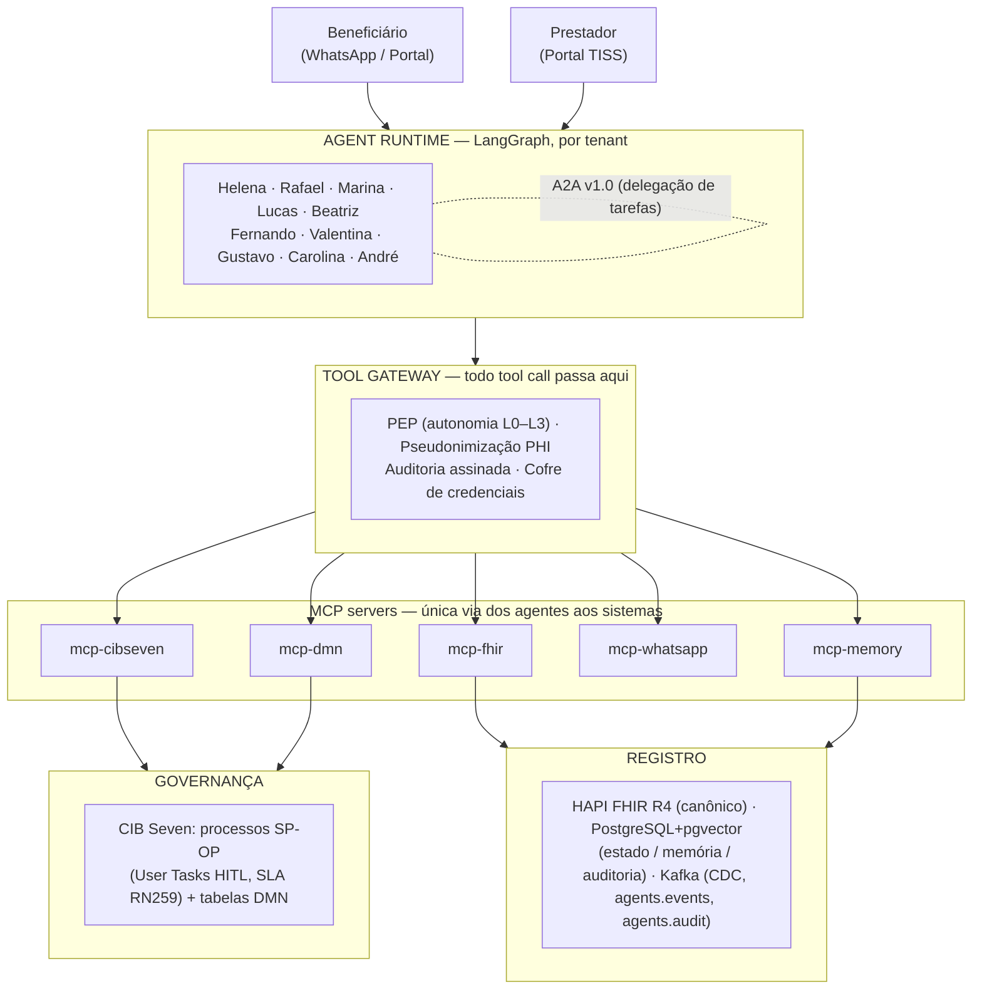

# Visão arquitetural

Maezo é uma plataforma **agents-first** para operadoras de saúde: dez agentes nomeados *operam* a
operadora (triagem, autorização prévia, contas, rede, fraude, compliance, receita), e o BPMN/DMN do
CIB Seven é a **espinha dorsal de governança** — não um BPM com IA acoplada, mas um cartório que
garante SLA regulatório, auditoria e escalonamento humano. A tese: o agente decide *como* trabalhar;
o processo garante *que* as obrigações regulatórias sejam cumpridas ([ADR-0001](../adr/0001-cib-seven-governance-langgraph-runtime.md)).

## Arquitetura do sistema



O agente **nunca** alcança um sistema diretamente: todo tool call atravessa o gateway, onde o PEP
avalia a matriz de autonomia, o PHI é pseudonimizado e a ação é auditada e assinada
([ADR-0005](../adr/0005-hitl-architectural-guarantee.md), [ADR-0006](../adr/0006-phi-two-zones.md),
[ADR-0007](../adr/0007-agent-identity-audit-non-repudiation.md)).

## Fluxo regulado com HITL: autorização prévia

A negativa de cobertura é **sempre** decisão de médico auditor humano, via User Task BPMN — nunca do
agente ([ADR-0005](../adr/0005-hitl-architectural-guarantee.md), L0 *hard* em
[ADR-0008](../adr/0008-autonomy-levels.md)).

```mermaid
sequenceDiagram
    participant P as Prestador (TISS)
    participant R as Rafael (agente)
    participant G as Tool Gateway / PEP
    participant E as CIB Seven (SP-OP-AUTH-001)
    participant MD as Médico auditor (User Task)

    P->>R: Guia TISS de autorização prévia
    R->>G: consulta DMN (admissibilidade / DUT-ROL / SLA)
    G-->>R: resultado determinístico (DMN, não LLM)
    R->>R: monta dossiê estruturado + recomendação
    R->>G: start SP-OP-AUTH-001 (process_key na allowlist)
    G->>E: instancia processo (auditado, assinado)
    Note over E: DMN sem saída de negativa;<br/>inelegibilidade/carência → análise humana
    E->>MD: User Task UT_AnaliseMedicoAuditor
    MD-->>E: decisão (deferir / negar) em nome do humano
    E-->>P: notificação — negativa transmitida, nunca decidida pelo agente
```

O worker que transmite a negativa é guardado por `ERR_AUTH_DENIAL_NOT_HUMAN`: o terminal adverso só
é alcançável após a User Task humana ([ADR-0018](../adr/0018-no-denial-structural-replication.md)).

## Stack & racional

> Stack: **Python 3.12 · LangGraph · A2A v1.0 · MCP · CIB Seven 2.1.3 · HAPI FHIR R4 · Kafka · PostgreSQL+pgvector · Kubernetes** ([PROJECT.md](../../PROJECT.md))

| Componente | Por quê | ADR |
|---|---|---|
| LangGraph (runtime) + CIB Seven (governança) | Agente decide *como*; BPMN garante *que* (SLA, HITL, trilha) | [0001](../adr/0001-cib-seven-governance-langgraph-runtime.md) |
| A2A v1.0 + Kafka | Delegação dirigida agente→agente com anti-loop estrutural; Kafka como log de fatos | [0003](../adr/0003-a2a-collaboration-kafka-facts.md), [0015](../adr/0015-a2a-delegation-runtime.md) |
| MCP servers | Única via dos agentes aos sistemas (cibseven/dmn/fhir/whatsapp/memory) | [0001](../adr/0001-cib-seven-governance-langgraph-runtime.md), [0016](../adr/0016-process-key-allowlist-phi-invariant.md) |
| PostgreSQL + pgvector | Estado, memória episódica/semântica e auditoria sem infra nova | [0002](../adr/0002-agent-state-three-layers.md) |
| DMN (CIB Seven) | Regra de negócio determinística, federada, versionada e testável fora do LLM | [0012](../adr/0012-dmn-deterministic-tool.md) |
| HAPI FHIR R4 | Registro clínico canônico; memória semântica referencia FHIR, nunca o copia | [0002](../adr/0002-agent-state-three-layers.md) |
| Portfolio de modelos (abstração de provider) | Troca de LLM sem reescrever agentes; eval gates por golden dataset | [0009](../adr/0009-model-portfolio-abstraction.md) |
| Kubernetes (namespace por tenant) | Isolamento absoluto de dados, memória e comportamento entre operadoras | [0004](../adr/0004-tenancy-federated-agent-definitions.md) |
| Tasy via CDC (Plataforma de Dados) | Integra dados do prestador via CDC, sem duplicar a fonte | [0013](../adr/0013-tasy-cdc-amh-data-platform-simulator.md) |
| Observabilidade (AMP/AMG gerenciados) | Telemetria de agentes sem operar Prometheus/Grafana in-cluster | [0014](../adr/0014-observability-platform-amp-amg.md) |

## Princípios por construção

As garantias são **estruturais**, não de prompt — violá-las exige comprometer a infraestrutura, não
convencer um LLM:

- **HITL / negativa humana.** PEP no gateway + User Task BPMN com timer/escalation + separação de
  credenciais (a credencial da ação proibida não existe no runtime do agente) + recusa auditada.
  Negativa, acusação de fraude, cancelamento e decisão clínica são **L0 *hard***, não rebaixáveis por
  tenant (o CI rejeita o rebaixamento). [ADR-0005](../adr/0005-hitl-architectural-guarantee.md),
  [ADR-0008](../adr/0008-autonomy-levels.md).
- **LGPD / PHI em duas zonas.** Zona Geral recebe PHI pseudonimizado antes do contexto LLM; Zona
  PHI/Financeira usa modelo on-prem ou endpoint BR-resident zero-retention, com egress restrito por
  rede (CIDRs IP-fixados, fail-closed, proibição de `0.0.0.0/0`).
  [ADR-0006](../adr/0006-phi-two-zones.md), [ADR-0017](../adr/0017-phi-egress-network-enforcement.md).
- **Multi-tenancy.** Instância própria de engine/banco/FHIR por tenant; zero contaminação.
  [ADR-0004](../adr/0004-tenancy-federated-agent-definitions.md).
- **Auditoria / não-repúdio.** Toda decisão tem trilha: quem (agente+versão), com base em quê
  (DMN+evidências), aprovado por quem. [ADR-0007](../adr/0007-agent-identity-audit-non-repudiation.md).
- **Regra determinística em DMN.** O LLM raciocina sobre o *resultado* da DMN; nunca a substitui.
  [ADR-0012](../adr/0012-dmn-deterministic-tool.md).
- **Allowlist de processo + invariante PHI.** O ToolRegistry só inicia `process_key` na allowlist
  congelada e força a pseudonimização no caminho de saída.
  [ADR-0016](../adr/0016-process-key-allowlist-phi-invariant.md).
- **Invariante no-denial.** Todo SP-OP negativa-like usa o desenho de cinco partes (DMN sem saída
  adversa, User Task humana obrigatória, worker guardado por erro, terminal inalcançável sem humano,
  prova de integração contra o engine real). [ADR-0018](../adr/0018-no-denial-structural-replication.md).

## Memória & estado

Estado em três camadas, LGPD-erasável e isolada por tenant
([ADR-0002](../adr/0002-agent-state-three-layers.md)):

1. **Working** — LangGraph checkpointer (PostgreSQL, schema `agents`); expurgo pós-tarefa.
2. **Episódica** — transcrições/decisões/eventos particionados por tenant, chaveados por
   `fhir_patient_id`; anexos em S3.
3. **Semântica** — derivados minimizados + embeddings pgvector. O conteúdo canônico **nunca** mora
   aqui: sempre referencia um recurso FHIR; embeddings são descartáveis/re-indexáveis.

A erasure LGPD por `fhir_patient_id` cascateia pelas três camadas, com verificação mensal.

## Governança de processos

O CIB Seven é o **cartório** (BPMN-as-cartório, [ADR-0001](../adr/0001-cib-seven-governance-langgraph-runtime.md)):
um processo SP-OP só existe se entregar SLA regulatório, HITL mandatório, auditoria de não-repúdio ou
transação multi-ator legal. Jornadas sem gatilho regulatório são conduzidas pelo próprio agente
(AGJ-*), documentadas no `agent.yaml` (ex.: `AGJ-HELENA-TRIAGE`). Cada SP-OP exige a quádrupla
`.bpmn` + contrato + DMNs derivadas + test spec. Catálogo completo (de `SP-OP-AUTH-001` a
`SP-OP-PAGTO-001`, por fase e status): [docs/processes/catalog.md](../processes/catalog.md).

## Fontes canônicas

Este overview é **canônico no repo** para a visão arquitetural. A autoridade por decisão é o ADR
correspondente em [docs/adr/](../adr/); divergências resolvem-se por novo ADR aqui. O resumo
executivo (arquitetura em 30s, mapa do repo, como rodar) é [PROJECT.md](../../PROJECT.md). O projeto
de arquitetura externo ("Orquestração de Processos com CIB Seven", `agents-first-architecture.md`)
permanece como background mais profundo, mas **não** é fonte normativa: onde divergir deste repo,
prevalece o ADR aqui.
