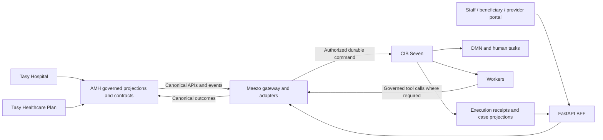

# Maezo Operadora — Product-first execution plan

> **Current continuity — 2026-09-10, WIP preservation complete:** [Current checkpoint](https://github.com/Omni-Saude/maezo-operadora/blob/completion/product-c27-auth-lifecycle/CHECKPOINT.md) supersedes historical scheduling/status below. Fresh status inspection covered 488 registered worktrees plus four standalone repositories; all 22 discovered uncommitted source files exactly match nine remotely verified recovery commits. Use `docs/prompts/maezo-wip-preservation-only.md` for a lower-cost WIP-only pass. Product implementation and release gates remain paused/pending. Frozen historical handoffs retain their original bytes; they are evidence, not current dispatch instructions.

Prepared: 2026-09-10. Status: **product execution paused; WIP preservation completed**. PLANS.md, RUNBOOK.md and CHECKPOINT.md hold current source, review and operational evidence. Baseline and preparation statements below describe the original inspection, not current completion.

This plan incorporates the user's product-first direction, Authorization-first journey, portal-first channels, mandatory BPMN/BPMNDI review, and confirmation that Tasy is the ERP behind AMH's data platform. It supersedes the previous repair-first scheduling where incompatible. It preserves the complete product scope, accepted business contracts, independent reviews, and production approval requirements of `docs/plan.md`. The earlier strategy proposal remains historical context.

## 1. Objective and completion model

Deliver complete employee, beneficiary, and provider experiences connected to real, authorized process execution. Reuse the existing engine, forms, workers, gateway, AMH contracts, and reviewed repairs. Build missing capabilities before spending capacity on independent tooling refinements.

The first accepted slice is: **provider submits an authorization request → beneficiary tracks and answers document requests → staff takes ownership and reviews/escalates → the permitted outcome and execution receipt become visible to the authorized participants**. External email/WhatsApp/TISS connectors are not prerequisites for the first portal slice. Portal communications must actually arrive in an authorized portal inbox/history; a Kafka publication alone is not delivery.

Measure four separate states per capability: implemented, integrated, operationally accepted, and externally approved where required. Report repairs separately. Never average unrelated denominators or infer product completion from test counts.

| Area | Inspected baseline | Required completion |
|---|---|---|
| Staff navigation | 2/7 operational areas: My work, Team queues | All seven areas, with functional case workspace |
| Beneficiary dedicated domain UI | 0/5 capabilities; shared session shell exists | Requests, status, document responses, communications, receipts |
| Provider dedicated domain UI | 0/5 capabilities; shared session shell exists | Guides, network requests, accounts/glosas, appeals, receipts |
| Human forms | 43/43 definitions/mappings | Positive/negative behavior through current authority and real execution |
| Initial decision admission | 6/43 bindings in the initial approved source scope | All 43; 37 remain outside that initial scope |
| AUTH/ESCALATION/PAGTO acceptance | 0/3 accepted browser-to-engine slices | Accepted workflow behavior; these names describe delivery order, not a new automatic business edge |
| W6 case access | Backend and bounded repair source-approved | Compose backend, native/runtime exposure, current identity producers, APIs and UI |
| Production BFF | Reusable ports/adapters, missing concrete providers | Real lifecycle, authority, custody, dispatch and receipt composition |
| Operations | Provisioning Stage 2 WIP; staging/transport qualification incomplete | Runnable staging, durable delivery, restore/rollback, monitored operation |

The ten AI-agent journeys already have underlying implementations. Audit their integration against the same process contracts; do not classify them as absent or create replacements merely because consolidated acceptance is missing.

## 2. Verified sources and limits

- Maezo candidate: `2ec0ac99ef1baef34e283468f151b5d02b774fb0` in `maezo-completion-wt/strategy-c5-delivery`; independent bounded composition approval exists, not release approval. Dirty ROOT `4c3e69f5` is coordination state and must be preserved. PR359 is merged; older references saying it is open are historical.
- W6 source: `3090c3c4` plus distinct repair `9e777120`; source approval does not prove native PostgreSQL, HTTP exposure or browser behavior. Inspect/preserve its worktree before composing.
- AMH remote `main` was inspected through authenticated GitHub at `8644efc9d72ea823639dcc8306823ab6da66240f`. Its local checkout was older; do not use that checkout as current truth without refreshing safely.
- The AMH integration manifest is published. Subject-context describes read-only clinical/coverage access. Provider Silver and FHIR role models exist. None establishes live endpoint availability or a complete human-to-provider delegation contract.
- AMH ADR-036 and the August 13 planning note document parked CDC/Kafka. Treat this as a deployment dependency requiring current verification, not proof of today's AWS state. Do not silently reactivate the parked environment or replace the approved wire protocol.
- AMH's August 13 note describes incomplete coverage of an older 85-fact inventory. Do not reuse its percentages as current completion. Derive the fact requirements from current contracts and consumers, then match them to AMH's current catalog and published interfaces.
- No test suite, database query, service startup, infrastructure change or patient-data access was performed to prepare this plan. Repository schemas/documentation are not a query of the live lake.

## 3. Architecture and ownership

Preserve React/TypeScript/Vite, FastAPI, CIB Seven 2.1.0, and ECS/Fargate in `sa-east-1`. AMH owns canonical data contracts, source crosswalks and its infrastructure state. Maezo owns payer cases, command execution, decision evidence, portal behavior and outcomes. Hospital and payer engines, credentials and process namespaces remain isolated.

Tasy Healthcare Plan supplies beneficiary/coverage and provider network/credentialing facts. Tasy Hospital supplies clinical context and clinical roles. AMH reconciles these sources while preserving their distinct provenance. Consume approved AMH APIs/events; do not introduce direct Oracle/Tasy access, raw CDC contracts, unrestricted lake queries, or source-system writes from Maezo.

Human OIDC identity is distinct from permission to act for a beneficiary or provider. The adapter must consume an authoritative, current relationship with scope, validity, revision and revocation semantics. Clinical affiliation, organization presence, CNPJ/CPF, email or a historical analytics row does not grant portal permissions.

## 4. Work packages and dependency order

Package names below identify accountable roles; assign actual eligible people/agents at execution. Do not assume the previous eight specialists are still available. Preserve the independent author/reviewer/repairer roles from the canonical plan.

| Package | Owner and dependencies | Deliverable and exit gate |
|---|---|---|
| E00 — Baseline and recovery boundary | ROOT; first | Confirm refs, frozen approved deltas, WIP, outstanding runtime ownership and applicable instructions. Record current queue in PLANS; do not replay historical investigations. |
| E01 — BPMN foundation and journey design | Process/product specialist; E00 | Full process/action inventory, duplicate/gap classification, reviewed BPMN/BPMNDI pattern, fact/impact matrix; freeze AUTH contract slice first. |
| E02 — AMH facts and identity links | Integration/data specialist + AMH owner; E01 slice | Current source-to-contract mapping, reusable API/projection inventory, missing publication/relationship contracts and producer/consumer implementations. Acceptance proves provider and beneficiary identity scope and revocation. |
| E03 — Production gateway and task ownership | Backend/native specialist; E01 contracts | Concrete read/mutation/receipt authority, claim/release/reassignment, lifecycle, outbox/relay and secret-provider composition. Acceptance proves authorized commands and current receipts. |
| E04 — Intake, documents and communication | Backend/product specialist; E01 contracts; integrates E02/E03 | Typed process starts, scoped case projection, secure attachment exchange, document-response correlation and portal communications. |
| E05 — Three-audience portal slice | Frontend specialist; starts on E01 API contracts | AUTH UI across all audiences; case dossier/history/documents, ownership controls and truthful command states. Integrates E02–E04. |
| E06 — First integrated authorization | ROOT schedules; independent process/security reviewer; E02–E05 and viable E09 runtime | Accepted synthetic browser-to-engine AUTH including document pendency, human decision/escalation and receipts. |
| E07 — Remaining decision families | Family specialists; E06 reusable mechanism | All 43 bindings operationally accepted; complete ESCALATION/PAGTO and other families with distinct positive/negative cases. |
| E08 — Complete product surfaces | Product/frontend/backend; E06 | Remaining employee navigation and beneficiary/provider capabilities across the processes in section 7. |
| E09 — Provisioning and staging | Runtime/infra specialist + infrastructure owner; starts after E00 | Finish controller behavior, approved startup path, durable transport, deployable images, migration/restore/rollback and monitored ECS staging. Preparation runs alongside product construction. |
| E10 — Integrated release and assurance | ROOT + two fresh independent final reviewers; E07/E08/E09 | Full applicable validation, ten agent journeys, evidence reconciliation, deployment demonstration, two approvals and handoff. |

E01 is not a requirement to finish every process redesign before any UI work. Inventory the foundation once, then freeze and build coherent slices. Acceptance dependencies do not prohibit parallel design, interface work or infrastructure preparation.

Use the existing maximum of four implementation packages, two approved packages awaiting integration and one frozen broad-validation candidate. Suggested initial allocation is process/contracts, AMH integration, gateway/runtime prerequisites and portal design; reassign the process slot to intake after AUTH is frozen. Schedule independent review without consuming final-reviewer identities. If runtime capacity is lower, keep this dependency order and reduce simultaneous work.

## 5. E01 — BPMN, DMN and BPMNDI foundation

### 5.1 Review outputs

For each existing process, record its purpose, trigger, participants, authoritative inputs, human tasks, outcomes, waits/timers, messages, called decisions, external-task topics and cross-process handoffs. Map every requested portal action to that inventory. Classify each proposed delta as reuse, missing wiring, behavioral extension, genuinely new process, or presentation-only correction.

Use a single traceability row per behavior: `requirement → process/version/element → DMN reference/version → variable producer/type/consumer → worker topic/error → MCP/tool/policy if used → event/correlation → API/form → audience state → receipt → acceptance evidence`. Extend the existing process catalog and contracts; do not create a parallel rules catalog.

Review duplication by business responsibility and lifecycle. Do not create separate beneficiary/provider BPMNs for the same authorization or reimbursement. Shared code/patterns do not automatically justify shared subprocesses. Login, browsing, filtering and ordinary reads remain application behavior unless a contract requires durable orchestration.

### 5.2 Improvement priorities

- Complete actual intake and document-response paths into the existing process starts and message waits.
- Ensure request-document and notification workers yield a user-visible, durable communication rather than a placeholder or publication with no consumer.
- Check missing paths for cancellation/withdrawal, expirations, handoff and unavailable authority against the applicable contract. Add only contracted behavior; do not invent deadlines or automatic adverse decisions.
- Preserve human-only decision boundaries, the provider-initiated appeal, and existing obligation checks before payment. No automatic CONTAS→RECURSO edge and no new AUTH→PAGTO edge.
- Check gateway completeness, variable initialization, timer cancellation, message correlation uniqueness, modeled worker errors and reachable outcomes. Fix defects that block the selected behavior as part of its package.

### 5.3 Visual standard

Preserve stable element IDs and positions where feasible. Follow the reviewed existing pattern: primary progression left to right, consistent alignment/spacing, identifiable branches and exception paths, readable labels and limited crossings. AUTH currently uses 100×80 tasks, 36×36 events and 50×50 gateways; use those defaults, enlarging where necessary for readability. Pools/lanes must represent real participants/responsibilities.

Include BPMNDI shapes/bounds, label placement and connector waypoints for all visible elements. Check attachment of boundary events, edge endpoints, collapsed/expanded subprocess representation and each applicable plane. Render changed diagrams in a compatible modeler and inspect them at useful zoom. Static DI coverage is complementary.

The inspected XML has missing DI for three INADIMPLÊNCIA elements: `BE_SuspensaoNaoHumano`, `End_SuspensaoBloqueadaNaoHumano`, `Flow_SuspensaoNaoHumano_End`. Repair their representation without altering execution. The other 15 files passed the limited node/flow-reference coverage check; they have not thereby passed visual review.

### 5.4 Cohesive deployment

For a presentation-only delta, compare executable XML after excluding only diagram namespaces; preserve executable extensions and semantic content. If behavior is unchanged, do not rerun unrelated engine suites.

For behavior changes, freeze the whole process/DMN/form/worker/adapter compatibility set. Preserve explicit binding/version rules and reviewed artifact digests. Default deployment affects new instances; existing instances remain on their original definitions with compatible workers. Inventory active waits and task bindings before activation. A change requiring instance migration needs a separate exact migration/rollback package; never silently rename IDs or reinterpret queued messages.

## 6. E02–E05 — Interfaces and implementation contracts

### 6.1 AMH data and authority delivery

Build a per-journey fact map starting with AUTH. Each fact records canonical name/type, purpose, authoritative product, existing AMH artifact, published API/event field, freshness requirement, provenance and missing work. Classify gaps as existing but unexposed, projection missing, consumer missing, or no authoritative source. Do not duplicate data that already exists under another name.

Inspect the signed source-authority manifest and current Tasy mappings to identify provider organization/network facts and representative/delegation records. The manifest distinguishes asserted owner-adjudicated authority from verified evidence; preserve that distinction. Do not infer table names or permissions. If Tasy lacks a required delegation record, document that concrete finding and have the upstream owner establish the authoritative delegation workflow before external access is enabled.

The AMH-owned relationship contract must distinguish the authenticated person, represented subject/organization, permitted operations, valid period, source revision, revocation and publication completeness/currentness. Use opaque identifiers and the established tenant/legal-entity boundary. Keep human login authentication in Maezo's dedicated OIDC flow. No browser-supplied principal or currentness assertion becomes authority.

Implement producer/consumer changes in their owning repositories, publish a versioned upstream manifest and update the Maezo immutable pin through its existing verification gate. Preserve source schemas instead of maintaining editable copies. A new adapter is unavailable until its required source is qualified; fixture-backed UI development remains explicitly synthetic.

### 6.2 Production composition

Reuse the components documented in `strategy-cycle1-20260910/bff-production-composition-preparation/REPORT.md`. That report was prepared on c4; recheck only changed inputs on the chosen candidate. Build concrete providers for:

- Read deployment admission, read credentials, cursor keys, current catalog/trust and membership publication handshake.
- Current **mutating** task authority, authorized evidence references and task transport. Q2 deliberately exposes no mutation authority; do not promote its read snapshot into permission.
- Signed decision bindings and native qualification/freeze/consumer authority from the provisioning plane.
- PHI authorization/custody and vault-backed keys in the correct security zone.
- Durable outbox database access, current receipt-resource authority, dedicated human signing identity and managed relay lifecycle.

Use one typed gateway composition/lifecycle: initialize and validate shared resources, construct request-local read bundles, manage dispatch separately from HTTP responses, close resources after partial startup or shutdown. Do not solve unavailable factories with no-op authority, dummy grants, shared agent credentials or self-issued qualification.

### 6.3 Public API changes

Preserve the existing `/api/v1/portal` session, task list/detail, decision-context, decision submission, command status and receipt routes. Generate TypeScript clients from OpenAPI. Preserve existing error/idempotency semantics and extend the closed typed contracts rather than accepting arbitrary engine variables.

| New surface under `/api/v1/portal` | Contract and behavior |
|---|---|
| `POST /tasks/{task_id}/assignments` | Typed discriminated claim/release/reassign request with command ID and expected revisions. Reuse existing claim/release admission. Reassignment requires new server/native support and an opaque target selected from authorized candidates. Acting user/tenant always come from the server. |
| `GET /tasks/{task_id}/assignment-candidates` | Current, permission-filtered candidates; unavailable or stale membership never expands the list. Reassignment privilege follows the task/role contract. |
| `GET /cases`, `GET /cases/{case_ref}`, `GET /cases/{case_ref}/history` | Audience-scoped projection, opaque cursor, current access checks and explicit freshness. Compose reviewed W6 access backend; staff dossier and external projection differ by allowed content. |
| `POST /intakes/{intake_type}` | Allowlisted typed request per process contract, command/idempotency ID, validated protected attachment refs. Resolve subject/provider link server-side; durable admission precedes acknowledgement. No arbitrary process key or variables. |
| `POST /intakes/{intake_ref}/document-uploads` and case-scoped equivalent | Authorized upload initiation tied to intake/case identity. Return an opaque upload reference and controlled upload mechanism. Limit type/size using the applicable document policy; no invented universal business limits. |
| `POST /document-uploads/{upload_ref}/complete` | Verify bytes, custody and screening before attachment becomes usable. Idempotent finalization; failed/quarantined files cannot satisfy a document request. |
| `GET /cases/{case_ref}/documents`, `GET /documents/{document_ref}/content` | Current identity/role/case authorization for listing and download; protected delivery, no persistent browser cache or disclosure through errors. |
| `POST /cases/{case_ref}/document-requests`, `POST /document-requests/{request_ref}/responses` | Authorized request and verified attachment response. Complete the correct pending process/message correlation once, using the existing audited effect boundary. |
| `GET/POST /cases/{case_ref}/communications` | Scoped in-portal conversation and system notices with sender provenance, intended audience and durable status. No automatic conversion of free text into a clinical decision. |
| `GET /operations/summary` and membership administration routes | Role-scoped operational views and governed membership actions. Confirm existing identity administration interfaces before adding routes; do not duplicate identity storage or expose PHI by administrator role. |

These are proposed new routes, not claims they exist. Reuse canonical immutable `HumanPrincipal`, `TaskSnapshot`, `TaskDecision` and `HumanCommandReceipt`; add closed DTOs for intake, documents, communications, reassignment and external-case projections. Keep an intake receipt distinct from a task-decision receipt. An opaque target reference for reassignment identifies the requested target; it does not supply acting authority.

Mutation outcomes must distinguish accepted/pending, executed with authenticated receipt, rejected/conflict, and uncertain/reconciling. A retry after lost acknowledgement uses the same command and payload. Do not display completion from HTTP 202, Kafka offset, outbox admission or historical assignee alone.

### 6.4 Task ownership and decision behavior

Current `AssignmentCommand` supports claim/release only. Implement reassignment across DTO, authorization, native transaction, audit/outbox, receipt and UI as one package. Revalidate target eligibility and current task revision within the authoritative operation; races with completion/timer/other reassignment must yield a controlled conflict without duplicate effects.

Expose only operations valid for the current task and principal. Preserve the 27 static candidate-group IDs and server-side resolution of four dynamic expressions. No bulk clinical, adverse or financial approval. Decision review includes evidence revision, form/process version and permitted outcome; stale context requires refresh and renewed review.

### 6.5 Documents and case identity

Create a durable intake record before process-start dispatch so documents have an authorized identity while no engine instance exists. Bind the resulting process/case reference idempotently after the start receipt. Never use an unverified browser identifier as a case membership grant.

Separate upload receipt, document verification, process-message correlation and business decision receipts. Handle upload interruption, duplicate finalization, expired authorization, wrong-case attachment and documents arriving after a timer. Preserve an auditable result rather than silently moving attachments to another request. Retention/erasure follows approved policies; no new retention durations are invented here.

## 7. Remaining product delivery batches

The counts below are the existing human-task inventory, not equal effort or runtime acceptance. Reconcile each binding against its exact form/process key before assignment.

| Batch | Processes and human tasks | Product outcome |
|---|---|---|
| First slice | AUTH 4; ESCALATION 2 | Three-audience authorization, document pendency, appropriate human escalation and outcome/receipt |
| Financial continuation | PAGTO 3; CONTAS 2; RECURSO 4 | Valid obligation/admissibility, accounts/glosas, provider-initiated appeal and authorized payment outcomes |
| Member requests | REEMBOLSO 4; CANCEL 2; LGPD-DSR 1 | Member intake/tracking, document exchange and contract-permitted dispositions |
| Network | CRED 4; ADEQUACAO 2 | Provider credentialing/network requests and remediation with staff/legal review |
| Care and restricted review | PROGRAMA 2; FRAUDE 3 | Scoped care/review workflows and restricted evidence access |
| Regulatory and contract operation | NIP 3; ANS-SUBMIT 5; INADIMPLENCIA 2 | Staff operational handling, permitted external visibility and required human decisions |

Total: 43 human tasks across 15 families. ANS-CRON has five timer-started definitions and no human tasks; expose monitoring, not a manual trigger. Finish PAGTO's initial slice after AUTH/ESCALATION without waiting for all later family UI. The 37 remaining bindings include any unqualified tasks inside an initially supported family; do not assume a family is complete because one form works.

Complete the staff navigation with these functional boundaries:

- **Overview:** role-appropriate workload, deadlines, pending actions and dependency freshness.
- **My work / Team queues:** working filters, paging, task ownership, conflicts and accessible refresh.
- **Cases:** search/list/detail, dossier, evidence provenance, chronological events and permitted actions.
- **Documents:** actual requests, upload verification, receipt/status and authorized download.
- **Operations:** process/command delivery health, incidents and governed recovery actions; no unrestricted engine console.
- **Administration:** governed membership and representation visibility/actions, revocation and audit; no implicit clinical privileges.

For beneficiaries and providers, navigation must lead to real typed intake and results rather than session-only welcome pages. Use audience-specific labels/projections over shared cases and workflows. Keep clinical detail, internal investigation material and operational logs out of external projections unless explicitly authorized by contract.

## 8. Provisioning, transport and deployment

Start infrastructure preparation with the first product slice. Preserve and finish the approved provisioning Stage 2 contract/WIP, including bounded publication, singleton ownership, real storage semantics and uncertain-result recovery. Do not reimplement reviewed Stage 1 or reopen qualified components without a relevant change.

The retained D7 preflight has uncertain remote effects and failed cleanup. Reconcile its exact ownership/resources under the existing recovery mandate before retrying or deleting anything. A shorter product runtime smoke may be used only if its prerequisites and ownership are independently qualified; it must not bypass the retained uncertainty or fabricate startup success.

For Kafka, verify actual AMH/Maezo staging resources and the owning Terraform state. Reuse a suitable existing broker or prepare the approved durable broker configuration; do not start a second unneeded transport or silently change the AMH parked-environment decision. Acceptance requires real topic/schema compatibility, authentication/ACLs, durable inbox/outbox, reconnect/replay and observable delivery. A published schema and an ephemeral developer broker are insufficient.

Deploy in this order: infrastructure and identities → compatible migrations → engine/plugin/bootstrap → gateway/read/authority publishers and workers → relay/agent runtime → BFF/frontend → synthetic integrated journeys. Pin the exact images, JAR, process/DMN bundle and AMH contract manifest used.

Use staged database migrations compatible with rollback. Validate backup restoration in a separate owned environment; do not restore over active data to prove a test. Rollback must preserve audit history, outbox commands, receipt reconciliation and existing process versions. Record exact rollback procedure, expected health signals and observed result before release approval.

## 9. Verification proportional to change

| Level | When and required evidence |
|---|---|
| Contract/static | Each affected package: schema/type/artifact references, BPMN error/topic compatibility, DMN variables, API generation consistency, architecture/secret fences. DI-only changes additionally prove unchanged executable semantics and render correctly. |
| Focused behavior | Changed rules/adapters/components: meaningful positive/negative tests, not mirrors of implementation. Reassignment, identity linkage and document correlation need race/failure cases. |
| Real service | Before accepting each affected vertical slice: actual CIB/PG and other relevant services, immutable code/config identities, nonzero execution evidence. No engine mock substitutes. |
| Browser/product | First AUTH and each subsequent audience capability: current authorization, complete user flow, truthful state/receipt, keyboard and screen reader, protected documents and useful recoverable errors. |
| Integrated candidate | Required lint/type/unit/artifact/security/frontend/evaluation/integration gates, all 43 tasks and ten agent journeys, concurrency/load/recovery and staging/restore/rollback evidence. |
| Final assurance | Two fresh eligible reviewers; all security-critical packages and seeded sample of at least 20% of the remainder; independent completion recount and resolution of disagreements. |

Required scenarios: duplicate click and conflicting payload; simultaneous reviewers/claimants; reassignment versus decision/timer; revoked or expired representation; cross-tenant and cross-provider access denial; forged identity/CSRF/agent-token misuse; wrong-case/quarantined document; delayed or duplicated message; audit failure preventing effects; engine crash/restart; lost acknowledgement with same-command recovery; receipt access after task completion under current authority; no PHI in browser errors/logging/cache.

Use current candidate commands, not historical recipes blindly. The inspected c5 Makefile's integration target now collects `tests/` with `integration and not chaos`; the earlier warning about a `tests/integration`-only target describes an older revision. Preserve collection/execution evidence and inspect the current recipe before use. Maven default compilation/tests do not prove `*EngineIT.java` execution.

Run `make lint type test validate-artifacts`, frontend `npm run verify`, and other applicable gates at the required package/train boundary. Do not repeat broad suites merely because a document or layout changed. Serially schedule heavy local jobs; reuse unchanged immutable evidence. A repeated failed run requires a new hypothesis or observation. Timeouts cannot be silently enlarged.

## 10. Repairs for human + LLM co-development

Track these in the existing PLANS/RUNBOOK queue, with links to frozen evidence. This is a routing policy, not a claim that every historical finding remains open.

| Category | Work and treatment |
|---|---|
| Mandatory for selected product behavior | Runtime startup/ownership recovery, current task/relationship authority, unsafe native effects, PHI/document custody, broken delivery/idempotency/receipts. Include necessary repairs with the affected product package; reuse already approved fixes. |
| Parallel but release-blocking | Accessibility, concurrency/recovery, audit/backup/rollback, deployment isolation, mandatory external approvals. Humans and LLMs may implement concurrently; acceptance remains required before the affected release. |
| Independently deferrable | Tooling/CI performance optimization, cosmetic refactors, nonessential historical cleanup and reconciliation. Defer only after proving no selected behavior or release requirement depends on them. |
| Concrete bounded W6 follow-up | Review observation C1 on cleanup cancellation/closed-connection state. Preserve its evidence that the connection closes and no dispatch/leak occurs; improve close-state idempotence separately if that bounded finding remains accurate. New leak/authority evidence makes it mandatory. |

Every deferred row includes owner, human + LLM suitability, affected feature, severity, evidence/reproduction, why deferrable, reactivation trigger and acceptance criteria. Never defer an unresolved security defect merely to improve feature percentages. Never give a repair author their own independent approval.

## 11. First execution cycle and handoff rules

1. Read this plan, current PLANS/CHECKPOINT and exact package receipts. Confirm candidate/ref state and WIP without resetting the dirty ROOT or discarding worktrees. Record which workers are actually available.
2. Freeze E01 AUTH journey/impact/fact matrix and BPMNDI example. Review the remaining process inventory for duplication in one bounded pass; send nonblocking improvements to the separate queue.
3. Start AMH relationship/fact publication and gateway-provider work alongside portal wireframes/contracts. Prepare deployment/transport prerequisites and identify the owning infrastructure state.
4. Compose approved W6 backend/repair onto the chosen candidate with a path-level compatibility review. Implement HTTP/intake/document/communication surfaces and current linkage; do not claim backend source approval proves product availability.
5. Implement ownership commands and AUTH workspace, including reassignment's new backend/native support. Freeze compatible OpenAPI and generated client changes with their consumers.
6. Integrate early and demonstrate one real AUTH journey before expanding the same mechanism. Finish initial ESCALATION/PAGTO, then deliver the remaining family batches and staff/external surfaces.
7. After each integrated acceptance, update capability counts, outstanding data/provider dependencies and separate repair queue. Review queue wait and repeated-test cost after two candidates; adjust staffing/WIP using observed bottlenecks.
8. Complete E10, required owner acts and handoff. Production activation remains a separate action bound to the exact approved revision/digests and actual credentials/ratifications. Follow `CONTRIBUTING.md` maintenance after each merge; preserve unique WIP/evidence and perform no mass cleanup.

An execution package must carry: bounded behavior, contracts and source inputs, owned paths, downstream impact, prerequisite status, acceptance cases, compatibility/rollback, independent reviewer and next integration gate. Persist runtime state only in the established coordination artifacts. Do not invent completion dates or token savings; measure time-to-accepted-capability, queue wait, relevant reruns and actual token telemetry when available.

## 12. Source references

Local: `docs/plan.md`; `docs/adr/0037-amh-compatibility-boundary-canonical-contracts.md`; `docs/adr/0038-adr0037-proibicao6-forma-chaves-cib.md`; `docs/adr/0049-portal-humano-e-comandos-atomicos.md`; current PLANS/CHECKPOINT; c5 portal/gateway/BPMN source; frozen W6 and BFF-composition reports under `/Users/familia/code/maezo-completion-evidence/strategy-cycle1-20260910/`.

AMH references below are pinned to the inspected remote revision:

- [ADR-042: canonical boundary and source authority](https://github.com/Omni-Saude/amh-data-platform/blob/8644efc9d72ea823639dcc8306823ab6da66240f/architecture/adrs/ADR-042-fronteira-compatibilidade-maezo-contratos-canonicos-amh.md).
- [Published canonical manifest](https://github.com/Omni-Saude/amh-data-platform/blob/8644efc9d72ea823639dcc8306823ab6da66240f/schemas/contracts/maezo/v1/contract-manifest.yaml).
- [Subject-context API](https://github.com/Omni-Saude/amh-data-platform/blob/8644efc9d72ea823639dcc8306823ab6da66240f/schemas/openapi/maezo/v1/subject-context.openapi.yaml).
- [Provider data model](https://github.com/Omni-Saude/amh-data-platform/blob/8644efc9d72ea823639dcc8306823ab6da66240f/schemas/iceberg/silver_entities/prestador.sql) and [PractitionerRole model](https://github.com/Omni-Saude/amh-data-platform/blob/8644efc9d72ea823639dcc8306823ab6da66240f/schemas/fhir-profiles/PractitionerRole-amh-profile.json).
- [Source-authority manifest](https://github.com/Omni-Saude/amh-data-platform/blob/8644efc9d72ea823639dcc8306823ab6da66240f/docs/governance/source-authority-manifest.md).
- [Parked CDC/Kafka decision](https://github.com/Omni-Saude/amh-data-platform/blob/8644efc9d72ea823639dcc8306823ab6da66240f/architecture/adrs/ADR-036-cdc-stack-parked-dev-and-dms-removal.md).
- [August 13 AMH planning note: transport and data gaps](https://github.com/Omni-Saude/amh-data-platform/blob/8644efc9d72ea823639dcc8306823ab6da66240f/docs/planning/plano-5f-5h-maezo-2026-08-13.md).
