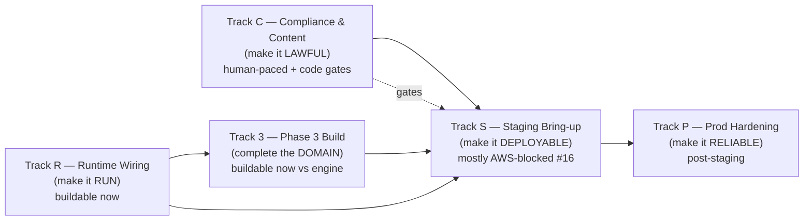
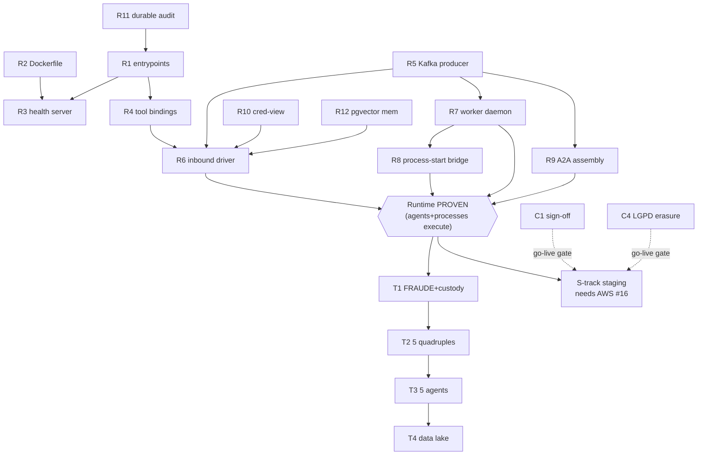

# Platform-Completion Plan — Maezo Healthcare Plan (from "Phase 2 complete" to "production operadora")

> **Forensic DevOps plan.** Produced after Phase 2 closed (main `b2641f5`) by a 6-domain read-only
> forensic sweep of the repository (processes/DMN · agents/evals · platform-runtime/A2A/MCP ·
> integrations/data · infra/deploy/CI-CD · security/compliance), cross-checked against the working
> tree. It uses the SWARM v2 PHASE BACKLOG as a starting point but deliberately goes **beyond** it:
> the backlog names Phase 3 features; this plan names everything between the current codebase and a
> **running, lawful, reliable** operadora platform — most of which the phase backlog never lists
> because it was scoped out as "runtime-wiring / deploy / sign-off."
>
> Siblings: [`phase2-plan.md`](phase2-plan.md) · [`phase2-report.md`](phase2-report.md) ·
> [`phase3-plan.md`](phase3-plan.md) · state in [`../handoffs/HANDOFF.yaml`](../handoffs/HANDOFF.yaml).

---

## 0. The one finding that reframes everything

**Maezo today is a library-with-tests, not a running system.** Every architectural primitive is
built, unit/integration-tested against the real CIB Seven engine in CI, and merged — but **nothing
runs as a long-lived service**, and the deploy manifests point at code that does not exist.

Independently verified at `b2641f5`:

| Claim | Evidence |
|---|---|
| No production service entrypoints | `find src/maezo -name __main__.py` → **0** (only `validation/cli.py` + `tasy_simulator/main.py`) |
| No application container image | `find -iname 'Dockerfile*'` → **none**; only `deploy/tasy_simulator.Dockerfile` exists; Helm `image.repository=.../maezo-agent` is built by nothing |
| Helm Deployments crash-loop | the 4 deployments run `python -m maezo.runtime.harness`, `…maezo.gateway`, `…maezo.platform.webhooks`, `…maezo.tools.mcp_fhir.sync` — the first three have **no `__main__`**, the fourth module **does not exist** |
| Pods never become Ready | probes hit `/healthz` + `/readyz` on `:8000`; `harness.py` serves **no HTTP** (`grep healthz harness.py` → 0) |
| Memory is process-local | `mcp_memory/server.py:176` `PostgresMemoryStore = InMemoryStore()` with `TODO(phase-1)` never done |
| Audit chain forks on restart | `audit.py` keeps `last_hash` **in memory** from GENESIS — 2 replicas or any restart silently break ADR-0007 tamper-evidence |
| A2A dispatcher is single-process, in-test-only | `DelegationDispatcher` assembled with real handlers **only in tests**; idempotency is an in-memory dict |
| The human-denial boundary is inert | console has **no Deployment**, OIDC is a header stub (`get_current_principal` raises `NotImplementedError`), signing handles are synthetic strings |

**Consequence for sequencing.** The biggest risk is building *more* of Phase 3 (six processes, five
agents, a data lake) on top of a runtime that cannot execute the nine processes and five agents we
**already** have. The highest-leverage work is therefore **not** new features — it is the
**runtime-wiring track** that turns the existing, CI-green libraries into running services. Until
that lands, every BPMN we author is never-executed XML and every agent is a graph that only runs in
pytest.

This plan is organised into **five delivery tracks**, sequenced so the platform becomes *executable*
before it becomes *bigger*, *lawful* before it goes live, and *reliable* before it scales.

---

## 1. What is genuinely DONE (the asset base)

Real, merged, CI-green — this is a strong foundation, not a prototype:

- **Process backbone:** 9 SP-OP quadruples (ESCALATION, AUTH, LGPD-DSR, CONTAS, RECURSO, NIP,
  ANS-SUBMIT, CANCEL, REEMBOLSO) — BPMN + 34 DMN + 11 worker modules + contracts + test-specs +
  ~8k LOC of integration tests proven on the **real** engine; a consolidated fail-closed no-denial
  sweep; a cross-process handoff *contract* seam.
- **Agents (libraries):** Helena, Rafael, Marina, Gustavo, Lucas — `agent.yaml` + LangGraph graph +
  contracts + delegation + golden datasets.
- **Platform primitives:** Tool Gateway (PEP + pseudonymizer + ToolRegistry single-seam, ADR-0016),
  runtime harness + L0–L3 merge engine + effective-version hash (ADR-0004/0007), inference router
  with PHI fail-closed sentinel, A2A delegation runtime + anti-loop (ADR-0015), credential vault,
  Phase-2 metrics catalog, médico-auditor console (factory), 5 in-process MCP servers + WorkerHarness.
- **Integration libraries:** Tasy simulator + FHIR-sync (Patient/Coverage) + WhatsApp inbound webhook
  + CNAB 240/400 parser — all well-typed and tested.
- **IaC foundation (never applied):** Terraform modules (aurora-postgres+pgvector, ecr, eks-cluster,
  github-oidc, secrets) for `staging-sa-east-1` + `prod-amh-sa-east-1`; a per-tenant Helm chart with
  per-agent Deployment factory, PHI NetworkPolicies (ADR-0006/0017), ExternalSecrets; `provision_tenant.py`;
  observability-as-code (dashboards, alert-rules); Alembic scaffold; one CI workflow with real-engine
  integration gating.

Everything above is **buildable-now**'s starting point: the unblocking is mostly *wiring + credentials*,
not re-architecture — exactly the consume-not-duplicate, vaulted-secrets posture ADR-0013 intended.

---

## 2. The five tracks (and why this order)

- **Track R (Runtime Wiring)** is the **keystone** and is **100% buildable now** (no AWS). It makes
  the existing nine processes + five agents actually execute. Everything else depends on it.
- **Track C (Compliance & Content)** runs in parallel with R/3 but is **human-paced** (médico-auditor /
  jurídico / DPO / regulatório / finanças sign-off) and adds **code gates** so green CI can never be
  mistaken for deployable. It is a **hard go-live gate** — no DRAFT artifact reaches a live tenant.
- **Track 3 (Phase 3 Build)** completes the operadora domain (fraud, credentialing, dunning, payments,
  network adequacy, care programs, population lake). Mostly buildable now against the engine + fixtures.
  Should start **after** Track R proves the runtime, so new BPMN is executable from day one.
- **Track S (Staging Bring-up)** turns it into a running deployment. **Mostly AWS-blocked (issue #16)**,
  but its code (Dockerfile, CD workflow, ingress, health server) is buildable now so AWS-landing is a
  *credentials swap*, not a build.
- **Track P (Prod Hardening)** makes it reliable at 80k-beneficiário scale (DR, SLOs, autoscaling,
  FQDN egress, WORM audit). Post-staging.

---

## 3. Track R — Runtime Wiring (the keystone; buildable NOW, no AWS)

> Goal: a real `helm install` brings up pods that reach **Ready**, consume work, drive agents and
> processes end-to-end, and survive restarts without breaking audit/idempotency. This is the single
> most important track and it needs **zero** external credentials.

| ID | Gap | Sev | Effort | Notes |
|---|---|---|---|---|
| **R1** | **Service entrypoints** — `__main__`/runnable for agent-runtime, gateway, worker daemon, fhir-sync, webhook-receiver, console, MCP boot. None exist; 3 of 4 Helm commands target missing/`__main__`-less modules. | blocker | L | The keystone of the keystone. `harness.py` is library-only ("Não executa o grafo"). |
| **R2** | **Application Dockerfile** — multi-stage py3.12 image (non-root uid 1000, read-only rootfs, per-component entrypoint) the whole ECR/Helm story already references but nothing builds. | blocker | M | Without it no image can be built or pushed at all. |
| **R3** | **Health/readiness server** — `/healthz` (process) + `/readyz` (checkpointer DB, Kafka, PEP matrix loaded, inference route resolvable, PHI sentinel state) + the `:8000` metrics endpoint, behind the existing probes. | blocker | M | Pods CrashLoop / never Ready without it. |
| **R4** | **GatewayTool bindings** — per-agent factory mapping each `agent.yaml` tool id (`mcp-dmn.evaluate`, `mcp-fhir.*`, `mcp-cibseven.start_process`, `mcp-whatsapp.send_message`, `mcp-memory.*`) to its real MCP coroutine, passed into `build_agent`. Today only the test `_harness.py` wires `RegistryToolInvoker`. | blocker | L | The harness validates the allowlist but never *builds* the tool fns. |
| **R5** | **Concrete Kafka producer** — one `aiokafka` impl wired into `KafkaSink` (`agents.audit`), `FactProducer` (`agents.events.*`), and the worker `KafkaPublisher`, with lifecycle in the entrypoints. | blocker | M | TLS/SASL to MSK is the only AWS-touch (config, not code). |
| **R6** | **Inbound consumer (driver)** — consume `agents.events.whatsapp.message-received` → resolve tenant/thread → resume checkpointer → drive the graph → emit outbound. Webhook is fire-and-forget into Kafka today; nothing consumes it into Helena. | blocker | L | No driver = no agent ever runs in prod. |
| **R7** | **External-task worker daemon** — service that builds `CibSevenWorkerTransport` + `WorkerHarness`, calls every `register_*_workers()`, runs the fetch-and-lock loop, + a Helm Deployment. Today `WorkerHarness` is instantiated **only in tests**. | blocker | L | Without it no SP-OP advances past its first external task. |
| **R8** | **Kafka→process-start bridge** — consumer of `operadora.notifications.internal` (+ `operadora.contas.start_recurso`, `operadora.nip.handoff_ans_submit`) that idempotently starts the downstream SP-OP. 8 producers, **0 consumers** today; cross-process handoffs are dead-ends. Also fix the NIP→ANS field-name drift in a tested prod helper. | blocker | M | Wave E proved the *contract*; this makes it *happen*. |
| **R9** | **A2A production assembly + durable idempotency** — build `AgentCardRegistry` from agent cards, register real handlers (Marina/Gustavo/Rafael), wire durable `AuditLog`+`FactProducer`, and replace the **in-memory** idempotency dict with a durable backing store (else restarts/replicas duplicate delegations). | blocker | L | In-memory idempotency is a correctness landmine under replicas. |
| **R10** | **Credential-view delivery** — wire `CredentialVault.agent_view(tenant=…)` into the runtime so the graph/tools get only the service-credential view. Vault is wired console-side (human) only. | blocker | M | No service credentials reach tool calls in a real deploy today. |
| **R11** | **Durable audit head** — Postgres audit sink + recover `last_hash` from the durable head on startup + multi-writer ordering. In-memory head **forks from GENESIS** on every restart, defeating ADR-0007. | blocker | M | The most dangerous "looks done" primitive. |
| **R12** | **Real memory store (pgvector)** — replace the `InMemoryStore` placeholder with the `agent_memory` table (tenant-partitioned, `vector(1536)`, ivfflat) + asyncpg pool + a real embedding provider. asyncpg/pgvector are already declared deps. | blocker | M | Episodic/semantic memory is process-local today. |
| **R13** | **Federation overlay loading** — per-tenant `overlays/*.yaml` + a pipeline step that generates the merged *effective* Agent Definition per tenant into the ConfigMap. Merge engine exists (#42) but defaults to identity; zero overlays on disk; nothing generates the mounted effective-def. | major | M | Required for real multi-tenant L0–L3 federation (ADR-0004). |
| **R14** | **MCP server boot decision** — either accept in-process `register_tools` at runtime boot (drop server framing) or build real stdio/SSE MCP servers + Deployments. Nothing calls `register_tools` at boot outside tests. | major | M | Pick one; in-process is the simpler default. |
| **R15** | **Legacy worker output-vars migration** — sweep Phase 0/1 workers (`phase0.py`/`auth.py`) still on the `None`-return (empty output-vars) contract; PR #37 added the contract but did not migrate the fleet. | major | M | Downstream BPMN paths referencing unset vars will mis-route. |
| **R16** | **Graceful shutdown** — SIGTERM drain across runtime/workers/fhir-sync/bridge: stop new work, checkpoint in-flight, complete/release locked external tasks, flush audit, close producers/pools; + Helm `preStop`/`terminationGracePeriodSeconds`. | major | M | Required before any rolling deploy is safe. |
| **R17** | **Proactive channel** — producers (CDC + feature-store) emitting PHI-minimized typed triggers + an in-zone consumer enforcing `consent_checked` before contact; adverse effects only via gated SP-OP. `agents.events.proactive` is registered but has **0** producers/consumers. | major | M | Shared with Phase 3 (Beatriz/Valentina/André). |

**Track-R Definition of Done:** `helm install` on a kind/dev cluster brings every pod to **Ready**; a
synthetic WhatsApp message drives Helena→Rafael→AUTH-001→console end-to-end through *running services*
(not pytest); a CONTAS RECORRER actually **starts** RECURSO via the bridge; restart a pod and the audit
chain + A2A idempotency survive. All verifiable **without AWS**, against the docker-compose engine + fakes.

---

## 4. Track C — Compliance & Content (make it LAWFUL; hard go-live gate)

> The runtime guarantee (no automated denial; HITL physical) is structurally enforced in code, but the
> **content** that flows through it is DRAFT. A real operadora cannot deploy DRAFT SLAs, RN thresholds,
> or glosa codes. This track is human-paced — the swarm's job is to **prepare** sign-off packages and
> **build the code gates** so unsigned content cannot ship.

| ID | Gap | Sev | Effort | Notes |
|---|---|---|---|---|
| **C1** | **Regulatory/clinical sign-off** of the ~24 DRAFT artifacts (`review-queue.md`): AUTH/LGPD SLAs, all 18 Phase-2 DMN tables (SLAs, admissibility/eligibility/routing thresholds, reembolso reference table + L2 ceiling, 26 glosa codes), CNAB offsets, contract sheets. Each needs médico-auditor / jurídico / DPO / regulatório / finanças. | blocker | XL (human) | Hard go-live gate; nothing DRAFT reaches a live tenant. |
| **C2** | **Content/promotion CI gate** — fail (or block deploy promotion of) any BPMN/DMN still carrying `DRAFT/verify` markers or unsigned in `review-queue.md`, tying artifact promotion to a recorded human sign-off. Today the no-deploy rule is **prose only**; `validate-artifacts` gates shape, not content. | major | S | Makes "green CI ≠ deployable" structurally true. |
| **C3** | **Business-day (dias-úteis) calendar service** — holiday-aware (national + ANS) dias-úteis→ISO backing every regulatory deadline. SLAs are static ISO durations today; deadlines miscompute around holidays → RN 388/424 breach risk. | major | M | Quietly load-bearing for every ANS/contractual SLA. |
| **C4** | **LGPD erasure cascade end-to-end** — `erase_by_patient` only pops an in-memory dict; ADR-0002 requires a cascade across memory (episodic+semantic), FHIR (HAPI), checkpointer state, and audit references by `fhir_patient_id`, plus upstream Tasy `op=d` DELETE propagation (today log+skip). Drive it from SP-OP-LGPD-DSR-001 (BPMN exists, no worker) and prove `erasure_coverage == 1.0`. | blocker | L | Treat as a hard go-live gate, not a Phase-3 nicety. |
| **C5** | **Process-catalog completeness review** — the 15-row catalog omits regulated processes a production operadora needs: portabilidade de carências (RN 438/186), reajuste anual/VCMH + faixa etária (RN 565/63), ressarcimento ao SUS (ABI/GIR), ouvidoria (RN 323), mobilidade/migração, population/atuarial DIOPS HITL filing. Decide SP-OP vs AGJ for each. | major | L | The genuine "beyond the backlog" regulatory-scope question. |
| **C6** | **Real ANS competência calendar** — replace synthetic hardcoded dates (`ans_calendar.dmn` "2026-02-15") with a regulatório-signed competência calendar per report_type; pairs with the cron job (S/R). | major | M | Blocks correct periodic ANS filing. |
| **C7** | **Allowlist start-enable (per signed process)** — **UPDATE: #32 merged by the owner — `KNOWN_PROCESS_KEYS` now holds the 6 Phase-2 keys, so the Phase-2 layer IS start-enabled.** Remaining: the Phase-3 +6 keys via human-gated PRs (ADR-0016, fail-closed) **as each process's content signs off**; and verify the tenant `allowed_process_keys` YAML matches per tenant. | major | S (per process) | The gate that turns built processes into runnable ones; intentionally human-gated. |
| **C8** | **Docs/traceability drift** — DMN README omits the 18 Phase-2 tables; `catalog.md` still marks Phase-2 processes "não iniciado"; runbook references a singular `agent-runtime` Deployment the chart renders per-agent; AGJ journey docs exist for only 1 of 10 agents. | minor | M | Traceability matters for a regulated audit. |

**Track-C DoD:** every artifact that can reach a live tenant carries a recorded human sign-off; the
content gate (C2) blocks any DRAFT from promotion; LGPD erasure proven `== 1.0` end-to-end; the catalog
scope decision is recorded as ADRs.

---

## 5. Track 3 — Phase 3 Build (complete the domain; buildable now)

> The full Phase 3 design is in [`phase3-plan.md`](phase3-plan.md). It is mostly buildable now against
> the real engine + fixtures. **Start it after Track R** so each new process/agent is executable, not
> shelf-ware. Critical path: `custody.py → FRAUDE-001 → Beatriz → W-E`.

| ID | Gap | Sev | Effort | Notes |
|---|---|---|---|---|
| **T1** | **SP-OP-FRAUDE-001 (pathfinder) + `custody.py`** — quadruple + Merkle `bundle_root` projection over the ADR-0007 hash-chain sealed **before** `UT_DecisaoInvestigador`; `register_fraud_accusation` human-gated (`ERR_FRAUD_ACCUSATION_NOT_HUMAN`); 3-part integrity test. Sink of all Phase-2 `encaminhar_fraude` handoffs. | blocker | XL | Proves the chain-of-custody class; de-risks the phase. |
| **T2** | **5 quadruples** — CRED-001 (two adverse directions; RN 567/566), INADIMPLENCIA-001 (RN 593; **harmonize business-keys with CANCEL-001 to avoid double-rescission of one `contract_termination` L0**), PAGTO-001 (value-driven `candidateGroups` via `pagto_alcada`; tier-match guard), ADEQUACAO-001 (RN 259; human-gated fallback financial commitment), PROGRAMA-001 (`ERR_PROGRAMA_NO_CONSENT` chokepoint + revocation boundary). | blocker | XL | Apply the 5-part no-denial pattern to all, regardless of L0/L1/L3. |
| **T3** | **5 agents** — Carolina (CRED, PHI), Fernando (INADIMPLENCIA, general), Valentina (PROGRAMA, PHI), Beatriz (FRAUDE, PHI, human-gated, must never set `decisao_fraude`), André (PAGTO + data lake, PHI). Each = agent.yaml + graph + delegation + golden(≥200) + eval + AGJ. **Persona→domain map is DRAFT — needs PO confirmation.** | major | XL | Each depends on its process. |
| **T4** | **Population data lake** — `platform/analytics/`: `PopulationFeatureClient` (read-only over amh Gold/Feature-Store), `ConsentGate(scope=operational_analytics)`, k-anonymity/small-cell suppression, LGPD-erasable aggregate lineage; propose **ADR-0019** (amh lake-of-record) + **ADR-0020** (chain-of-custody). No boto3/pyarrow deps yet. | major | XL | Largest unbuilt block; consume-not-duplicate (ADR-0013). |
| **T5** | **FHIR payer-scope expansion** — map AUTORIZACAO_CONVENIO → Claim/ClaimResponse/CoverageEligibilityResponse; add Organization (Coverage.payor) + PractitionerRole (network/credentialing); enrich Patient address. Today only Patient+Coverage sync end-to-end. | major | L | Agents should read auth/claim status from FHIR, not raw process vars. |
| **T6** | **Tasy simulator scope** — as the permanent CI contract, add Organization/PractitionerRole/Claim tables, DELETE ops, malformed envelopes (exercise DLQ), schema-version pinning, Avro+Glue parity. Today: 3 happy-path tables only. | major | M | The simulator is the contract; it must mirror the full payer surface. |
| **T7** | **CNAB reconciliation loop** — wire the (built, unwired) CNAB 240/400 parser into an ingestion + reconciliation engine that emits `status_conciliado` to Lucas, instead of Lucas consuming pre-resolved facts. | major | L | Parser is dead code today. |
| **T8** | **FHIR-sync DLQ redrive** — consumer/redrive + alerting for `cdc.amh.tasy.fhir-sync.dlq` (write-once dead letters today; a transient HAPI outage drops events permanently). | major | M | Production resilience for the PHI sync path. |
| **T9** | **Eval coverage + gate hardening** — rubrics/golden(≥200)/eval modules for the 5 Phase-3 agents incl. zero-false-adverse KPIs; expand Gustavo(62)/Lucas(48)/Marina(192)/Rafael(196) datasets to ≥200; harden the gate so empty-collection (exit 5) is **not** PASS and per-agent thresholds + `min_dataset_size` are enforced. | major | L | Live-mode evals need contracted keys (Track S). |

**Track-3 DoD:** all 15 catalog processes built + engine-proven with the no-denial invariant; 10 agents
built with evals ≥ threshold; data lake + proactive channel running against fixtures; INADIMPLENCIA↔CANCEL
double-rescission resolved by an ADR.

---

## 6. Track S — Staging Bring-up (make it DEPLOYABLE; mostly AWS-blocked, issue #16)

> The code half of this track is **buildable now** (Dockerfile, CD workflow, ingress, health server,
> in-cluster dep strategy) so the moment AWS lands, bring-up is a *credentials swap + apply*, not a build.
> Build a localstack/tflocal scaffold so the first apply can be smoke-tested offline.

| ID | Gap | Sev | AWS? | Effort |
|---|---|---|---|---|
| **S0** | **AWS access (master blocker, issue #16)** — account + IAM in sa-east-1, the amh shared substrate (VPC tags, EKS name, MSK secret, S3 state bucket + DynamoDB lock), and the 5 BLK creds (Tasy Oracle, WABA, LLM general+PHI, PHI-zone BR endpoint). Gates every apply/populate/verify. | blocker | ✅ | XL (external) |
| **S1** | **`terraform apply` staging→prod** — first init(backend)+plan+apply; the amh references (VPC/EKS/MSK/secret data sources) must resolve. `validate` runs in CI today; **nothing has ever planned/applied**. | blocker | ✅ | L |
| **S2** | **Migration runner** — Helm pre-install/upgrade Job running `alembic upgrade head` per tenant + automating the `AsyncPostgresSaver.setup()` seam + pgvector `CREATE EXTENSION`. One migration exists; nothing applies it. | blocker | ✅ | M |
| **S3** | **Secrets population + ESO path** — fill the 3 BLOCKED secret shells; verify SecretStore CR + ESO IRSA actually sync into the k8s Secrets the Deployments mount. | blocker | ✅ | M |
| **S4** | **CD pipeline** — build+push image to ECR via the (existing, unused) OIDC deploy role; `helm upgrade --install` to staging; smoke tests; `workflow_dispatch` manual-approval promotion to prod; documented rollback. CI ends at *validate* today. | blocker | partial | L |
| **S5** | **Ingress / TLS / DNS** — ALB-ingress or nginx + cert-manager/ACM + Route53/external-dns so the WhatsApp webhook and console are reachable over HTTPS. Chart emits ClusterIP only. | blocker | partial | M |
| **S6** | **In-cluster dependencies** — production strategy for CIB Seven (StatefulSet/operator + its Postgres), HAPI-FHIR, and MSK topic/ACL provisioning. The chart provisions **none** of these (docker-compose only); agent env points at `cibseven:8080`/`hapi-fhir:8080`/`KAFKA_BOOTSTRAP`. | blocker | partial | L |
| **S7** | **PHI-zone LLM endpoint + provider** — real BR-resident zero-retention endpoint replacing `_PhiNotConfiguredProvider`; wire `ProviderCredentials` from secret into `build_router()`. Blocks **all** PHI agents (Rafael, Marina, + 4 Phase-3). | blocker | ✅ | M |
| **S8** | **Console OIDC/Cognito auth + serving** — real JWT validation (JWKS/iss/aud/exp) + group mapping replacing the header stub; Deployment/Service/TLS Ingress for the console. The human-denial boundary cannot run until this lands. | blocker | ✅ | M |
| **S9** | **Credential vault KMS/HSM backend** — make `SigningCredential.handle` resolve to a real signing op + per-tenant provisioning + the console code path that actually signs a denial. | major | ✅ | M |
| **S10** | **AMP/AMG observability Terraform** — provision AMP workspace + AMG + ADOT IRSA (SigV4 remote-write) + load `alert-rules.yaml` via the AMP Rules API + X-Ray. `otel-collector.yaml` has only commented stubs; no module exists. | major | ✅ | M |
| **S11** | **Real external integrations** (design+test now, enforce at deploy): Tasy/MSK Avro+Glue binding (+fastavro dep), WABA outbound (`WabaCloudTransport` never instantiated; token=`BLOCKED`), ANS/regdata real transmission (`mcp-ans`/`mcp-regdata` don't exist; `protocolo_ans` is a SHA of business-key), bank disbursement + remessa for reembolso (echo + hash today), CNAB bank-file offset validation, WhatsApp media download. | blocker | ✅ | XL |
| **S12** | **Agent Service + scrape** — a `Service` + PodMonitor/scrape annotations for agent-runtime + fhir-sync (`:8000` metrics are unaddressable today; only gateway/webhook have Services). | major | partial | S |

**Track-S DoD:** staging cluster running the full chart, all pods Ready, migrations applied, secrets
synced, a real WhatsApp message handled end-to-end through staging, ANS/bank/PHI-LLM integrations
exercised against real endpoints (or contracted sandboxes), CD promotes to prod behind manual approval.

---

## 7. Track P — Prod Hardening (make it RELIABLE; post-staging)

| ID | Gap | Sev | AWS? | Effort |
|---|---|---|---|---|
| **P1** | **Autoscaling + availability** — HPA (CPU/RAM or Kafka-lag) + PDB per workload + cluster autoscaler (Karpenter/CA) + metrics-server. Replicas are static; the runbook says "scale manually". | major | ✅ | M |
| **P2** | **DR / backup / PITR** — Aurora snapshot/PITR restore drill, checkpointer durability + replay validation, audit-chain WORM backup, Kafka retention/TTL, RPO/RTO, restore runbook. None exist; staging Aurora is writer-only, retention 3d, deletion_protection off. | major | ✅ | L |
| **P3** | **SLOs + alerting + on-call** — SLIs/SLOs/error budgets (turn latency, PEP rate, audit-emit lag, external-task completion, consumer lag, A2A success), Alertmanager/AMP routing to PagerDuty/Opsgenie/Slack, AMG dashboard provisioning, OTEL traces webhook→graph→tool→MCP→engine. Rules authored; **nothing pages**. | major | ✅ | M |
| **P4** | **FQDN egress enforcement** — egress proxy (Squid SNI) or Cilium FQDN policy. NetworkPolicy `ipBlock` is CIDR-only (ADR-0017 stopgap); any service sharing the CIDR is reachable. | major | ✅ | L |
| **P5** | **Audit durable WORM** — S3 Object-Lock backing for the hash-chain (beyond the durable Postgres head in R11), with retention matching regulatory 5+ years and legal-hold vs LGPD-erasure reconciliation. | blocker | ✅ | L |
| **P6** | **CDC/FHIR-sync resilience** — consumer-group scaling, real broker-lag SLO + alert (lag is heuristic today), replay/offset DR runbook, schema-version guard. | major | partial | M |
| **P7** | **Webhook idempotency (Redis)** — replace default `InMemoryIdempotencyStore` (double-processes across replicas) with the existing `RedisIdempotencyStore` + add the redis dep. | major | ✅ | S |
| **P8** | **Cost guardrails** — AWS Budgets/Cost Anomaly per env + tag-based allocation + LLM spend caps. | minor | ✅ | S |
| **P9** | **Live-mode evals as deploy gate** — nightly live evals against contracted LLMs (incl. PHI agents once S7 lands); per-agent threshold ≥ 0.9 enforced as a promotion gate. | major | ✅ | M |
| **P10** | **Scaled chaos / pen-test / multi-tenant isolation proof** — re-run the Phase-0 chaos/PHI-leak/PEP-bypass suites against staging at scale + a cross-tenant isolation proof. | major | partial | M |

**Track-P DoD:** load test at 80k-beneficiário scale within SLO; a DR restore drill passes RPO/RTO; a
node drain causes no tenant outage (PDB); a page fires on a synthetic SLO breach; FQDN egress proven;
audit chain survives WORM tamper test.

---

## 8. Critical path & the smallest set that unblocks the most

**The single highest-leverage move:** land **R1+R2+R3+R5** (entrypoints, image, health server, Kafka
producer). They convert the entire merged codebase from "passes tests" to "runs," and they are the
hard dependency of every other runtime, deploy, and Phase-3 item. They need **no AWS**.

---

## 9. Buildable-NOW vs AWS-blocked (issue #16) — the honest split

**Buildable + verifiable now (no credentials; CI + docker-compose engine + fixtures):** all of Track R
(R1–R17); Track C code gates (C2, C3, C4 cascade+test, C7 allowlist, C8 docs); all of Track 3 (T1–T9
against the engine + simulator); and the **code** of Track S (R2 Dockerfile, S4 CD workflow YAML,
S5 ingress templates, S6 in-cluster dep strategy, S12 Services) + a localstack/tflocal smoke harness.

**AWS / credential / human-paced blocked (issue #16):** `terraform apply` (S1), migration *run* (S2),
secrets *population* (S3), PHI-LLM endpoint (S7), real Tasy/MSK-Avro + WABA + ANS + bank + S3-WORM +
Lake-Formation (S11/P5), Cognito (S8), AMP/AMG provisioning (S10), live evals (P9); and the **human**
sign-off of C1/C5/C6 (médico-auditor/jurídico/DPO/regulatório/finanças).

> Architectural reassurance (ADR-0013): unblocking is mostly **credential injection + apply**, not
> re-architecture. Build everything against fakes first so AWS-landing is a swap.

---

## 10. Top landmines (things that look done but aren't)

1. **In-memory audit chain (R11)** — forks from GENESIS on every restart/replica, *silently* defeating
   ADR-0007 tamper-evidence. The most dangerous "looks finished" primitive. Fix before any 2-replica run.
2. **In-memory A2A idempotency (R9)** — duplicate delegations across restarts/replicas.
3. **The human-denial boundary is inert (S8)** — no console Deployment, OIDC stubbed, synthetic signing
   handle. The zero-denial invariant currently holds partly *because nothing runs*; once it runs, no
   denial can be *formalized* until the console + vault signing path are live.
4. **Stub-implies-effect (S11)** — ANS submit, reembolso payment, and CNAB reconciliation have worker
   *names* implying external effects the code does not perform (publish/log/echo + SHA-of-business-key
   IDs). Highest "does nothing in prod" risk; the SHA `protocolo_ans`/`comprovante_ref` are the tell.
5. **Double-rescission L0 (T2)** — CANCEL-001 already owns the rescission terminals; INADIMPLENCIA-001
   must not terminate the same `contract_termination` twice. Resolve ownership in an ADR before authoring.
6. **Content vs shape** — every Phase-2 DMN is engine-deployable-*shape* but DRAFT-*content*, and
   `validate-artifacts` gates shape only. Green CI ≠ deployable until C2 exists.
7. **No app Dockerfile + crash-looping Helm (R2/R1)** — the entire ECR/Helm story points at an image
   nothing builds and entrypoints that don't exist.
8. **amh substrate is referenced-not-owned** — VPC/EKS/MSK/S3/OIDC/state-bucket come from
   amh-data-platform by tag/data-source; the first `apply` fails fast if those don't match. Untested
   because nothing has ever planned. A localstack/tflocal smoke harness de-risks this cheaply.

---

## 11. Definition of Done — "complete platform"

The platform is **production-complete** when:

- **Runs:** `helm install` brings all pods Ready; a real WhatsApp message is handled end-to-end through
  running services; every SP-OP advances through its external tasks and cross-process handoffs; restart
  preserves audit + idempotency. *(Track R + S6)*
- **Lawful:** zero DRAFT artifacts in any live tenant; the content gate blocks unsigned promotion; LGPD
  erasure proven `== 1.0`; the no-denial invariant monitored in prod. *(Track C)*
- **Complete:** all 15 (+ catalog-review additions) SP-OP processes and all 10 agents built, engine-proven,
  evals ≥ threshold; data lake + proactive channel live. *(Track 3)*
- **Deployable:** staging→prod CD with migrations, secrets, ingress/TLS, real ANS/bank/PHI-LLM
  integrations, behind manual-approval promotion. *(Track S)*
- **Reliable:** within SLO at 80k-beneficiário scale; DR drill passes RPO/RTO; autoscaling + PDB; FQDN
  egress + WORM audit; paging on SLO breach. *(Track P)*

---

## 12. Recommended execution waves (orchestrator)

Disjoint file owners, anti-stall briefs (§4-bis-D), build→adversarial-verify, one phase ahead on drafts.

| Wave | Tracks | Parallelism | Gate |
|---|---|---|---|
| **W-R0** | R2, R3, R1 (agent-runtime entrypoint first), R5 | image + health + Kafka producer in parallel; entrypoint depends on them | dev `helm install` → Ready; agent runs as a service |
| **W-R1** | R4, R10, R12, R11 | disjoint (tools / cred-view / memory / audit) | Helena drives end-to-end as a running service |
| **W-R2** | R7, R6, R8, R9 | worker daemon + inbound driver + bridge + A2A | CONTAS→RECURSO *starts* downstream; A2A durable |
| **W-R3** | R13, R14, R15, R16, R17 | federation / MCP boot / migration / shutdown / proactive | restart-safe, multi-tenant overlay, SIGTERM-clean |
| **W-C** *(parallel, human-paced)* | C2, C3, C4, C7, C8 + prepare C1/C5/C6 sign-off packages | code gates buildable now; sign-off external | content gate green; LGPD == 1.0 |
| **W-3A** | T1 (FRAUDE + custody, **solo pathfinder**) | none | engine-proven custody-before-decision |
| **W-3B/C/D** | T2 (5 quadruples) → T3 (5 agents) → T4 (data lake); T5–T9 in parallel | disjoint owners per process/agent | per `phase3-plan.md` waves + INAD↔CANCEL ADR |
| **W-S** *(on AWS #16)* | S0→S1→S2→S3, then S4/S5/S6/S7/S8 | code (Dockerfile/CD/ingress) pre-built in W-R | staging end-to-end + prod promotion |
| **W-P** *(post-staging)* | P1–P10 | parallel | scale + DR + SLO DoD |

**Immediate next action (no AWS, highest leverage):** spawn **W-R0** — the application Dockerfile,
the `/healthz`+`/readyz` server, the agent-runtime service entrypoint, and the concrete Kafka producer.
These four turn the whole CI-green codebase into something that runs.

---

## Appendix A — Consolidated gap register (deduplicated)

Severity: 🔴 blocker · 🟠 major · 🟡 minor. AWS = needs issue #16. Effort: S/M/L/XL.

| ID | Track | Sev | AWS | Eff | One-line |
|---|---|---|---|---|---|
| R1 service-entrypoints | R | 🔴 | – | L | no `__main__` anywhere; 3/4 Helm cmds target missing/entrypoint-less modules |
| R2 app-dockerfile | R | 🔴 | – | M | no image is built for the whole ECR/Helm story |
| R3 health-server | R | 🔴 | – | M | probes hit `/healthz`+`/readyz`; harness serves no HTTP |
| R4 gatewaytool-bindings | R | 🔴 | – | L | agent tool-ids never bound to real MCP fns outside tests |
| R5 kafka-producer | R | 🔴 | – | M | no concrete producer for audit/facts/notifications |
| R6 inbound-driver | R | 🔴 | – | L | webhook→Kafka has no consumer driving a graph |
| R7 worker-daemon | R | 🔴 | – | L | `WorkerHarness` instantiated only in tests; no Deployment |
| R8 process-start-bridge | R | 🔴 | – | M | `operadora.notifications.internal` 8 producers, 0 consumers |
| R9 a2a-prod-assembly | R | 🔴 | – | L | dispatcher real only in tests; in-memory idempotency |
| R10 cred-view-delivery | R | 🔴 | – | M | `agent_view` never reaches the runtime |
| R11 durable-audit-head | R | 🔴 | – | M | in-memory hash-chain forks on restart (ADR-0007 break) |
| R12 memory-pgvector | R | 🔴 | – | M | `PostgresMemoryStore` is an `InMemoryStore` placeholder |
| R13 federation-overlays | R | 🟠 | – | M | zero tenant overlays; no effective-def generator |
| R14 mcp-boot | R | 🟠 | – | M | `register_tools` never called at boot outside tests |
| R15 worker-output-vars-migration | R | 🟠 | – | M | legacy Phase 0/1 workers on `None`-return contract |
| R16 graceful-shutdown | R | 🟠 | – | M | no SIGTERM drain anywhere |
| R17 proactive-channel | R | 🟠 | – | M | `agents.events.proactive` has 0 producers/consumers |
| C1 regulatory-signoff | C | 🔴 | – | XL(h) | ~24 DRAFT artifacts unsigned |
| C2 content-ci-gate | C | 🟠 | – | S | no gate blocks DRAFT promotion |
| C3 business-day-calendar | C | 🟠 | – | M | no holiday-aware dias-úteis→ISO |
| C4 lgpd-erasure-cascade | C | 🔴 | – | L | erase only pops in-memory dict; no cascade/test; no DELETE propagation |
| C5 catalog-completeness | C | 🟠 | – | L | reajuste/ressarcimento-SUS/ouvidoria/portabilidade missing |
| C6 ans-calendar-real-dates | C | 🟠 | – | M | synthetic hardcoded competência dates |
| C7 allowlist-start-enable | C | 🟠 | – | S(ea) | #32 MERGED → Phase-2 keys startable; only Phase-3 +6 remain |
| C8 docs-drift | C | 🟡 | – | M | DMN README/catalog/runbook/AGJ stale |
| T1 fraude+custody | 3 | 🔴 | – | XL | pathfinder; chain-of-custody class |
| T2 5-quadruples | 3 | 🔴 | – | XL | CRED/INAD/PAGTO/ADEQUACAO/PROGRAMA (+INAD↔CANCEL ADR) |
| T3 5-agents | 3 | 🟠 | – | XL | Carolina/Fernando/Valentina/Beatriz/André (persona-map DRAFT) |
| T4 data-lake | 3 | 🟠 | – | XL | analytics pkg + PopulationFeatureClient + ConsentGate; ADR-0019/0020 |
| T5 fhir-payer-scope | 3 | 🟠 | – | L | Claim/ClaimResponse/Organization/PractitionerRole |
| T6 simulator-scope | 3 | 🟠 | – | M | Org/Claim/DELETE/malformed/Avro fixtures |
| T7 cnab-reconciliation | 3 | 🟠 | – | L | parser is dead code; wire ingestion+reconciliation |
| T8 fhir-dlq-redrive | 3 | 🟠 | – | M | DLQ write-once, no redrive |
| T9 eval-coverage+gate | 3 | 🟠 | – | L | Phase-3 evals + datasets≥200 + gate hardening |
| S0 aws-access | S | 🔴 | ✅ | XL | master blocker (issue #16) |
| S1 terraform-apply | S | 🔴 | ✅ | L | never planned/applied; backend uncommented |
| S2 migration-runner | S | 🔴 | ✅ | M | no `alembic upgrade` in deploy |
| S3 secrets-population | S | 🔴 | ✅ | M | 3 BLOCKED shells; ESO path untested |
| S4 cd-pipeline | S | 🔴 | ◑ | L | CI ends at validate; no build/push/deploy/smoke/promote |
| S5 ingress-tls | S | 🔴 | ◑ | M | ClusterIP only; no ALB/cert-manager/DNS |
| S6 incluster-deps | S | 🔴 | ◑ | L | chart provisions no CIB Seven/HAPI/Kafka |
| S7 phi-llm-endpoint | S | 🔴 | ✅ | M | `_PhiNotConfiguredProvider` blocks all PHI agents |
| S8 console-oidc+serving | S | 🔴 | ✅ | M | OIDC stub; no console Deployment; denial boundary inert |
| S9 credvault-kms | S | 🟠 | ✅ | M | synthetic signing handle; no real sign path |
| S10 amp-amg-terraform | S | 🟠 | ✅ | M | managed observability stubbed only |
| S11 real-integrations | S | 🔴 | ✅ | XL | Tasy/MSK-Avro, WABA, ANS, bank disbursement, WA media |
| S12 agent-service-scrape | S | 🟠 | ◑ | S | agent/fhir-sync metrics unaddressable |
| P1 hpa-pdb-autoscale | P | 🟠 | ✅ | M | static replicas; manual scaling |
| P2 dr-backup-pitr | P | 🟠 | ✅ | L | no restore drill/RPO/RTO |
| P3 slo-alerting-oncall | P | 🟠 | ✅ | M | rules authored; nothing pages |
| P4 fqdn-egress | P | 🟠 | ✅ | L | CIDR-only egress (ADR-0017 stopgap) |
| P5 audit-worm | P | 🔴 | ✅ | L | no S3 Object-Lock for the chain |
| P6 cdc-dr-scaling | P | 🟠 | ◑ | M | single consumer; heuristic lag |
| P7 webhook-redis-idempotency | P | 🟠 | ✅ | S | in-memory dedup double-processes across replicas |
| P8 cost-guardrails | P | 🟡 | ✅ | S | no budgets/anomaly/LLM caps |
| P9 live-eval-gate | P | 🟠 | ✅ | M | fake-mode only; exit-5 treated as PASS |
| P10 scaled-chaos-pentest | P | 🟠 | ◑ | M | re-run chaos/PHI/PEP at staging scale |

*Total: ~57 consolidated gaps (from ~107 raw findings across 6 domains). ◑ = code buildable now, execution AWS-blocked.*

---

*Forensic source: workflow `platform-completion-forensics` (6 read-only auditors), cross-checked
against the working tree at `b2641f5`. Every gap cites file-path evidence in the source inventory.
This plan is orchestrator planning metadata (DL-0003); it commits no product code.*
